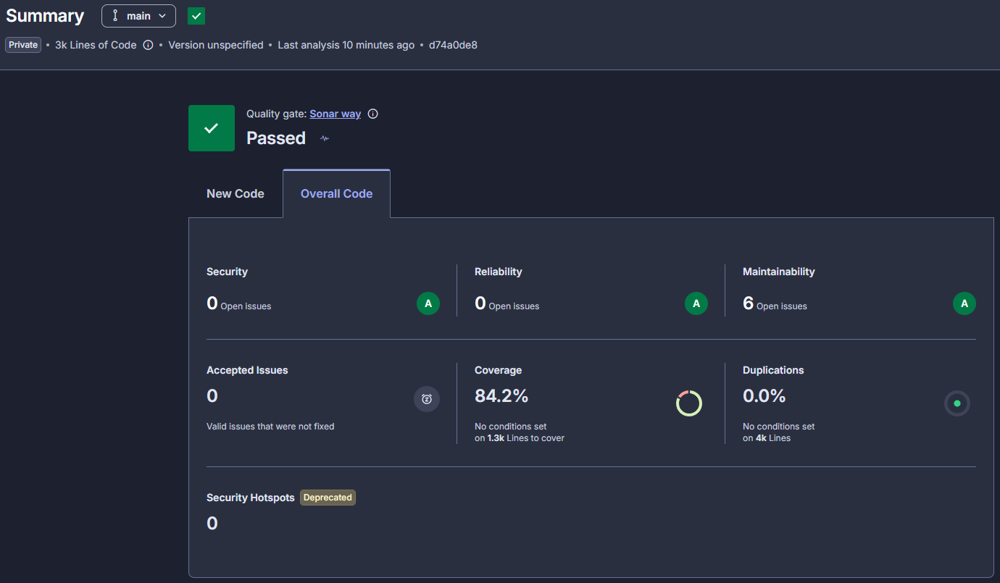

# auto-repair-shop

Microsserviço **order** do Auto Repair Shop: dono do ciclo de vida da ordem de serviço, do
cliente e do veículo. É o read model da saga: não conhece catálogo nem preço, e grava como
snapshot os itens já precificados que chegam do execution. Kotlin com arquitetura hexagonal
multi-módulo sobre PostgreSQL.

---

## Arquitetura

### Autenticação

O app **não valida assinatura JWT** nem armazena credenciais. Toda autenticação é delegada ao **API Gateway + Lambda Authorizer**. O app recebe o `Authorization: Bearer <jwt>` já validado, decodifica as claims (`sub`, `role`, `cpf`) e confia.

- Rotas protegidas usam `authenticate("admin")` ou `authenticate("attendant")` (Ktor) com `JwtBearerAuthenticationProvider`.
- Sem `Authorization: Bearer <jwt>` → `401 Unauthorized`.
- Role inválida para o endpoint → `403 Forbidden`.

### Fluxo coreografado por eventos

O order é dono da OS, do cliente e do veículo. Catálogo de serviços, estoque de insumos,
reservas e diagnóstico ficam no *execution*; orçamento e pagamento, no *billing*. Não há
orquestrador central: o estado da saga é derivado do status da OS, movido por eventos.

Identidade não passa por banco: quem abriu a OS vem do JWT (`sub` e `cpf`) e é gravado como `openedBy`; quem diagnosticou chega no payload do `DiagnoseFinished` e é gravado como `diagnosedBy`, nulo enquanto a OS espera diagnóstico. Não existe tabela de atendentes; os dois são referências a usuários de outro domínio, sem chave estrangeira.

- **Produz** `OrderCreated` ao abrir a OS (fino: cliente e veículo, sem itens) e `OrderAwaitingApproval` quando o diagnóstico chega precificado.
- **Consome** de billing (`PaymentConfirmed`, `QuoteRejected`, `PaymentFailed`) e de execution (`DiagnoseFinished`, `ExecutionStarted`, `ExecutionFinished`, `SuppliesUnavailable`, `ExecutionFailed`, `ReservationExpired`).

**Saída (outbox → SNS):** `OrderCreated` e `OrderAwaitingApproval` são gravados na tabela `events` (outbox) na mesma transação que muda a OS. Um scheduler (`OutboxRelayTask` → `OutboxRelay`) publica o envelope no tópico `auto-repair-shop-order-events-{env}` com os message attributes `eventType` (camelCase) e `traceparent`.

**Entrada (SQS → dispatch):** o `InboundEventConsumer` faz long-poll da fila `auto-repair-shop-order-queue-{env}`, desserializa o envelope e despacha por `eventType` para os `InboundEventHandler`s. A fila recebe um superset (mesh): `eventType` sem handler é ignorado e a mensagem é apagada. Idempotência por `eventId` na tabela `idempotency`.

```
[OrderUseCase.create] ──▶ [events (outbox)] ──(OutboxRelayTask)──▶ [OutboxRelay] ──▶ SNS order-events

SQS (fila de entrada) ──(InboundEventConsumer)──▶ InboundEventHandler ──▶ OrderListenerUseCase
```

**Status derivado:** `RECEIVED → WAITING_APPROVAL → EXECUTION_ENQUEUED → IN_PROGRESS → COMPLETED → DELIVERED`, mais `CANCELED` a partir de qualquer estado não terminal. `RECEIVED` significa "aguardando diagnóstico". Não existe estado de diagnóstico em curso, porque o mecânico pega a OS da fila e conclui o diagnóstico numa chamada só.

| Evento consumido | Efeito no status da OS |
|---|---|
| `DiagnoseFinished` | `RECEIVED → WAITING_APPROVAL`, grava o snapshot precificado e o `diagnosedBy`, e emite `OrderAwaitingApproval` (que **não** repassa o `diagnosedBy`) |
| `PaymentConfirmed` | `WAITING_APPROVAL → EXECUTION_ENQUEUED` |
| `ExecutionStarted` | `EXECUTION_ENQUEUED → IN_PROGRESS` |
| `ExecutionFinished` | `IN_PROGRESS → COMPLETED` |
| `SuppliesUnavailable`, `QuoteRejected`, `PaymentFailed`, `ExecutionFailed`, `ReservationExpired` | `→ CANCELED` |
| entrega manual (REST) | `COMPLETED → DELIVERED` |

Todas as transições são idempotentes (evento repetido ou fora de ordem vira no-op).

O order usa `EXECUTION_ENQUEUED` onde o execution usa `ENQUEUED` para o mesmo instante. É deliberado: o nome do status da OS diz **o que** está enfileirado.

Contrato completo dos eventos: `auto-repair-shop-infra/docs/saga-event-contract.md`.

### Observabilidade

- **Métricas**: Micrometer + Prometheus em `/metrics`. ServiceMonitor faz scrape a cada 30s.
- **Logs**: JSON estruturado via logstash-logback-encoder, com `traceId`/`spanId`/`requestId` do MDC. O Alloy daemonset coleta e envia ao Loki.
- **Tracing**: auto-injetado pelo OpenTelemetry Operator. O Deployment traz a annotation `instrumentation.opentelemetry.io/inject-java: "true"`. Traces vão ao Tempo via Alloy.
- **Counters de negócio**, como saem no `/metrics`: `orders_total`, `orders_by_status_total{status}`, `order_inbound_events_total`. O meter de criação se chama `orders_created_total` no código, mas `_created` é sufixo reservado do OpenMetrics e é removido no scrape, então as queries do Grafana usam `orders_total`.

---

## Estrutura de Pastas

```
auto-repair-shop/
├── main/                  # Aplicação principal (entry point, DI)
├── domain/                # Lógica de negócio (modelos, use cases, ports)
├── api/                   # REST API (Ktor routes, DTOs)
├── storage/               # Persistência (Exposed, Flyway migrations)
├── consumer/              # Consumidor SQS e handlers de evento
├── producer/              # Outbox → SNS
├── worker/                # Schedulers (relay do outbox)
├── metric/                # Micrometer
├── infra/
│   ├── k8s/               # Kustomize (base/ + overlays/{hml,prod}/)
│   └── load-test/         # Teste de carga (K6)
├── .github/workflows/     # CI/CD
├── Dockerfile             # Multi-stage build (JDK + JRE)
├── docker-compose.yaml    # Orquestração local (app + PostgreSQL)
└── build.gradle.kts
```

> **Infraestrutura AWS e plataforma K8s** (VPC, EKS, RDS, Prometheus Operator, OTel Operator, Alloy/Loki/Tempo, ServiceAccount, Namespace) vivem em [`auto-repair-shop-infra`](https://github.com/ivanzao/auto-repair-shop-infra). Este repo só carrega manifestos app-específicos (Deployment, Service, ConfigMap, HPA, ServiceMonitor) via Kustomize.

---

## Stack

- **Linguagem**: Kotlin 2.2.10
- **JVM**: Java 21
- **Build**: Gradle 8.14 (Kotlin DSL)
- **Web Framework**: Ktor 3.3.3
- **DI**: Koin 4.1.1
- **Database**: PostgreSQL 18.1
- **ORM**: Exposed 0.61.0
- **Migrations**: Flyway
- **Messaging**: AWS SDK for Kotlin (SNS + SQS)
- **Observabilidade**: Micrometer Prometheus, logstash-logback-encoder
- **Testing**: JUnit 5, MockK, TestContainers, Cucumber (BDD)
- **Qualidade**: JaCoCo, SonarCloud
- **Infra (app-side)**: Docker, Kustomize, GitHub Actions

---

## Execução Local

### Opção 1: Docker Compose (recomendado)

```bash
./gradlew :main:shadowJar
docker-compose up --build -d
docker-compose logs -f app
```

Acesse:
- API: http://localhost:8080/v1
- Swagger UI: http://localhost:8080/swagger
- Health: http://localhost:8080/health
- Metrics: http://localhost:8080/metrics

### Opção 2: Sem Docker

```bash
./gradlew build
./gradlew :main:run
```

### Banco local

```
Host: localhost   Port: 5432   Database: auto-repair-shop
Username: app     Password: test
```

---

## Testes

```bash
./gradlew test                    # unitários
./gradlew integrationTest         # requer Docker (TestContainers Postgres + LocalStack SNS/SQS)
./gradlew bddTest                 # fluxo BDD (Cucumber) ponta a ponta; requer Docker
./gradlew jacocoAggregatedReport  # relatório em build/reports/jacoco/...
```

O `bddTest` cobre o fluxo completo (criação → `OrderCreated` → diagnóstico → `OrderAwaitingApproval` → pagamento → execução → conclusão) e cenários de compensação (`SuppliesUnavailable` e `QuoteRejected` → `CANCELED`), com billing e execution simulados por eventos na fila do LocalStack (`main/src/test/resources/features/order_flow.feature`).

### Cobertura



Análise a cada PR pelo step `Sonar` do `pr-check.yaml`, no projeto `auto-repair-shop` da
organização `ivanzao`. O quality gate exige 80% de cobertura em código novo.

Ficam fora da contagem o wiring de framework (`config`, `auth`, `metric`), o módulo `main` e os
DTOs, código sem lógica de negócio própria, ainda analisado para bugs e code smells.

Para reproduzir localmente:

```bash
./gradlew test integrationTest bddTest jacocoAggregatedReport
```

### Load Test (K6)

```bash
k6 run --env K6_BASE_URL=<API_GW_URL> infra/load-test/k6-stress-test.js
```

---

## API

- **Base path**: `/v1`
- **Swagger UI**: `/swagger` (execução local)
- **Spec**: `api/src/main/resources/openapi/documentation.yaml`
- **Health**: `/health` · **Metrics**: `/metrics`
- **Autenticação**: `Authorization: Bearer <jwt>`, validado pelo Lambda Authorizer no API Gateway
- **Identidade**: `openedBy` vem do JWT de quem abriu a OS; `diagnosedBy` chega no payload do
  `DiagnoseFinished`. Não há tabela de atendentes neste serviço.

---

## Deploy em Kubernetes

```
infra/k8s/
├── base/
│   ├── deployment.yaml         # Container, probes, envFrom
│   ├── service.yaml            # NodePort (valor vem do SSM)
│   ├── configmap.yaml
│   ├── hpa.yaml                # CPU 70% (min/max no overlay)
│   ├── servicemonitor.yaml     # Prometheus scrape de /metrics
│   └── kustomization.yaml
└── overlays/
    ├── hml/{kustomization,deployment-patch,configmap-patch,nodeport-patch}.yaml
    └── prod/{kustomization,deployment-patch,configmap-patch,nodeport-patch}.yaml
```

Aplicar manualmente:

```bash
kubectl apply -k infra/k8s/overlays/hml
```

O CI lê os params do SSM, busca as credenciais do banco no Secrets Manager e reescreve o ConfigMap antes do apply:

| Param SSM | Conteúdo | Uso |
|-----------|----------|-----|
| `/auto-repair-shop/{env}/eks/cluster-name` | nome do cluster EKS | `aws eks update-kubeconfig` |
| `/auto-repair-shop/{env}/order/db/secret-arn` | ARN do Secrets Manager com as credenciais do app | `aws secretsmanager get-secret-value` → JSON com host, port, dbname, username, password |
| `/auto-repair-shop/{env}/sns/order-events-topic-arn` | ARN do tópico de eventos do order | `SNS_TOPIC_ARN` no ConfigMap |
| `/auto-repair-shop/{env}/sqs/order-queue-url` | URL da fila de entrada do order | `SQS_QUEUE_URL` no ConfigMap |
| `/auto-repair-shop/{env}/order/node-port` | NodePort do Service | patch do `nodeport-patch.yaml` |
| `/auto-repair-shop/{env}/apigw/endpoint` | endpoint do API Gateway | smoke test pós-deploy |

Todos os params são **obrigatórios**: se algum não existir, o deploy falha no step de leitura do SSM.

---

## CI/CD

| Workflow | Trigger | Jobs |
|----------|---------|------|
| `pr-check.yaml` | PR para `main` | unit + integration + BDD + Sonar |
| `build-and-deploy.yaml` | push em `main` | Test → Build (Docker → GHCR) → deploy hml → deploy prod |

O deploy de produção usa GitHub Environment com `required_reviewers`: o job fica pendente até
aprovação manual.

### Secrets necessários

| Secret | Descrição |
|--------|-----------|
| `AWS_ACCESS_KEY_ID` | Chave de acesso AWS |
| `AWS_SECRET_ACCESS_KEY` | Chave secreta AWS |
| `AWS_SESSION_TOKEN` | Token de sessão AWS |
| `GHCR_PAT` / `GHCR_TOKEN` | Personal Access Token para o GHCR |
| `SONAR_TOKEN` | Token do SonarCloud |

Todo o resto (endpoint do banco, ARN do SNS, endpoint do API Gateway) vem do SSM. A senha do banco vem do Secrets Manager, com o ARN lido do SSM.
