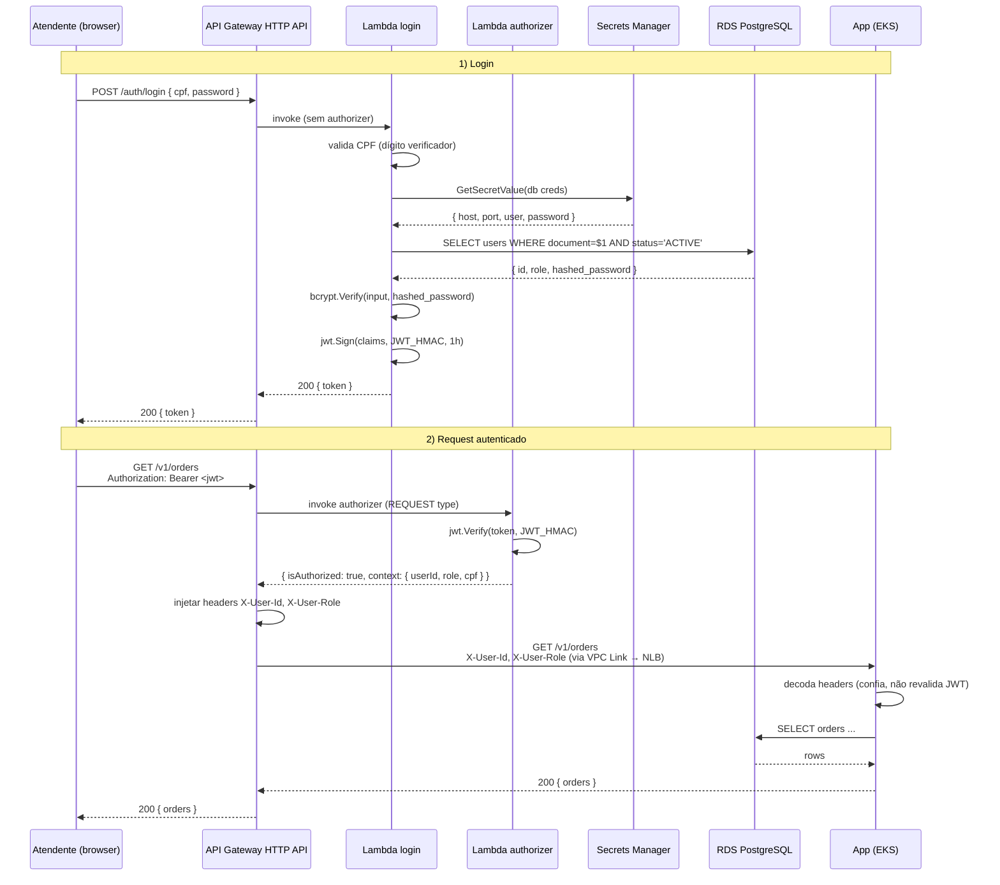

# 02 — Sequence: Autenticação CPF + JWT

Fluxo completo do login até o consumo de uma rota protegida.

## Garantias

- **JWT é HS256** — segredo `JWT_HMAC` por ambiente, vivendo em GitHub Secrets e injetado nas Lambdas via `update-function-configuration`. O app **não** conhece o segredo (não precisa revalidar).
- **TTL do authorizer**: 5 min de cache (`authorizer_result_ttl_in_seconds = 300`). Para revogação imediata é necessário rotacionar o `JWT_HMAC` (rotação de chave invalida todos os tokens).
- **CPF**: validação completa do dígito verificador antes de qualquer query ao banco — protege contra brute force com CPFs sintéticos.
- **Bcrypt**: comparação resistente a timing attacks (subtle).
- **Status do user**: query filtra `status='ACTIVE'`. Desativar = apenas mudar para `INACTIVE` (sem delete, preserva histórico).

## Erros mapeados

| Cenário | Resposta |
|---|---|
| CPF inválido (dígito errado) | 401 `invalid credentials` (mesma resposta de senha errada — não vaza existência) |
| User não encontrado ou `INACTIVE` | 401 `invalid credentials` |
| Senha errada | 401 `invalid credentials` |
| Token expirado ou inválido | Authorizer retorna `isAuthorized: false` → API GW responde 401 |
| Token válido mas role insuficiente | App responde 403 (validado pelo Ktor `authenticate("admin"|"attendant")`) |
