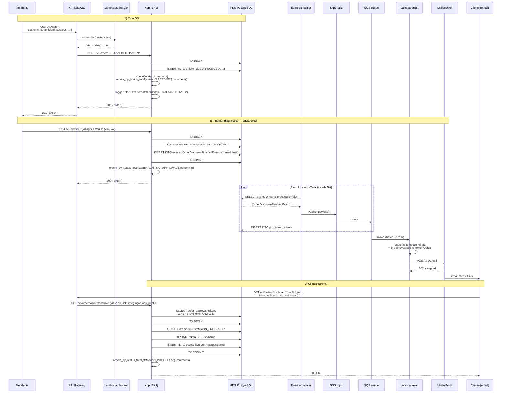

# 03 — Sequence: Abertura de Ordem de Serviço

Fluxo desde o POST de criação até a aprovação do orçamento pelo cliente via email.

## Pontos-chave

- **Transactional Outbox**: gravar mudança de estado + evento na mesma transação garante eventual consistency. Se o scheduler não rodar, ninguém solta SNS — mas o estado do banco está correto.
- **Idempotência**: `processed_events` evita duplicação. SQS DLQ recebe falhas após N tentativas.
- **ShedLock**: `EventProcessorTask` usa lock distribuído via tabela `shedlock` — múltiplos pods da app não disputam o outbox.
- **Aprovação por link público**: o cliente não tem JWT. A rota é exposta no API Gateway sem authorizer (integração `app_public`) e o token UUID single-use no DB serve de credencial.
- **Métricas observáveis** durante o fluxo:
  - `orders_total` (o meter se chama `orders_created_total`; `_created` é reservado e cai no scrape)
  - `orders_by_status_total{status}` em cada transição
  - `http_server_requests_seconds_*` (OTel auto-injection)
  - Logs em `OrderUseCase` com `orderId`, `status`, `traceId` (MDC)
