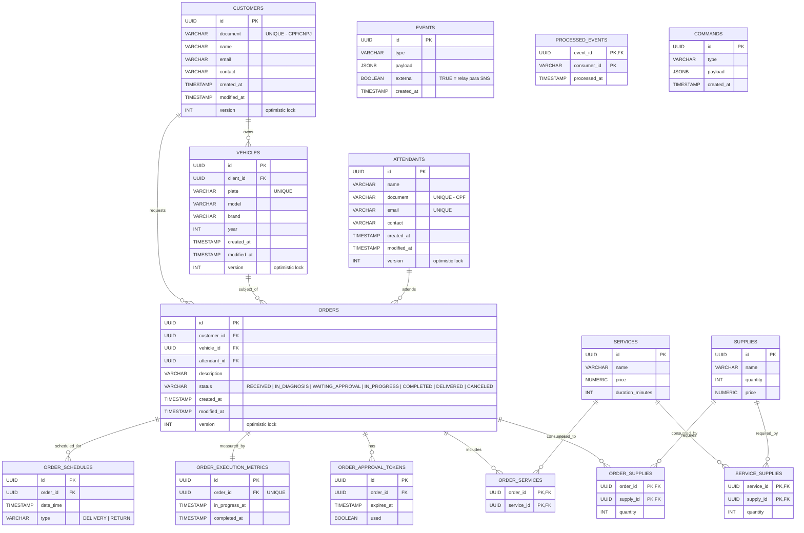

# 04 — ER Model

Modelo entidade-relacionamento do schema PostgreSQL reconciliado com as migrations Flyway (V1–V13).

## Relacionamentos principais

- **CUSTOMER 1—N VEHICLE**: cliente pode ter múltiplos veículos
- **CUSTOMER 1—N ORDER**: cliente abre múltiplas OS ao longo do tempo
- **VEHICLE 1—N ORDER**: histórico de manutenção por veículo
- **ATTENDANT 1—N ORDER**: cada OS é atendida por exatamente 1 atendente
- **ORDER N—N SERVICE** via `order_services`
- **ORDER N—N SUPPLY** via `order_supplies` (suprimentos consumidos com quantidade)
- **SERVICE N—N SUPPLY** via `service_supplies` (insumos default por tipo de serviço)
- **ORDER 1—N ORDER_APPROVAL_TOKEN**: cada vez que se envia email pro cliente aprovar, gera novo token UUID
- **ORDER 1—1 ORDER_EXECUTION_METRICS**: registro de tempo em execução, UNIQUE constraint garante singleton
- **EVENTS / PROCESSED_EVENTS**: outbox + idempotência

Ver [Modelo Relacional — Justificativa formal](../database/modelo-relacional.md) para discussão das escolhas de schema, índices e justificativa do banco.
