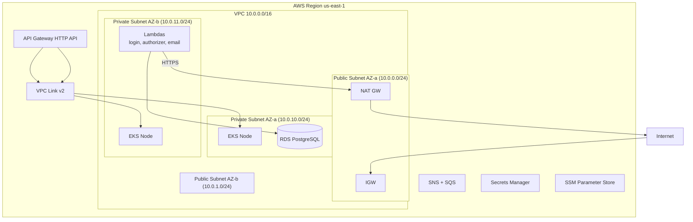

# Plan 5: Documentação arquitetural + Vídeo demo Implementation Plan

> **For agentic workers:** REQUIRED SUB-SKILL: Use superpowers:subagent-driven-development (recommended) or superpowers:executing-plans to implement this plan task-by-task. Steps use checkbox (`- [ ]`) syntax for tracking.

**Goal:** Produzir toda documentação arquitetural exigida pelo enunciado — 4 RFCs, 11 ADRs, 6 diagramas (Mermaid), justificativa formal do banco com modelo ER, READMEs dos 4 repos — e gravar vídeo demonstração de até 15 minutos.

**Architecture:** Documentação cross-cutting mora em `auto-repair-shop/docs/architecture/`. Cada repo tem README local com diagrama do seu escopo. Todos os diagramas em Mermaid (renderizam no GitHub). RFCs e ADRs em Markdown com templates consistentes.

**Tech Stack:** Markdown, Mermaid, OBS Studio ou Loom (vídeo).

---

## Pré-requisitos

- **Plans 1-4 completados e funcionando end-to-end**
- Spec aprovada
- Acesso de gravação de tela (OBS Studio, Loom, QuickTime)

---

## File Structure

```
auto-repair-shop/docs/architecture/
├── README.md
├── diagrams/
│   ├── 01-component-overview.md
│   ├── 02-deployment-aws.md
│   ├── 03-sequence-auth.md
│   ├── 04-sequence-authorize-request.md
│   ├── 05-sequence-create-order.md
│   ├── 06-sequence-outbox-email-notification.md
│   └── 07-er-model.md
├── rfcs/
│   ├── RFC-001-cloud-aws.md
│   ├── RFC-002-database-postgresql.md
│   ├── RFC-003-auth-cpf-password.md
│   └── RFC-004-observability-stack.md
├── adrs/
│   ├── ADR-001-api-gateway-vpc-link-nlb.md
│   ├── ADR-002-lambda-authorizer-header-injection.md
│   ├── ADR-003-helm-vs-kustomize.md
│   ├── ADR-004-terraform-state-and-ssm-registry.md
│   ├── ADR-005-hpa-config.md
│   ├── ADR-006-multi-env-single-cluster-namespaces.md
│   ├── ADR-007-secrets-github-as-source-of-truth.md
│   ├── ADR-008-lambda-go-provided-al2023.md
│   ├── ADR-009-lambdas-monorepo-with-separate-tf-state.md
│   ├── ADR-010-outbox-via-existing-events-table.md
│   └── ADR-011-db-credentials-per-environment.md
└── database/
    └── modelo-relacional.md
```

---

## Task 1: Setup da estrutura de pastas e index

**Files:**
- Create: `docs/architecture/README.md` (index)

- [ ] **Step 1: Criar estrutura**

```bash
cd auto-repair-shop
mkdir -p docs/architecture/{diagrams,rfcs,adrs,database}
```

- [ ] **Step 2: Criar `docs/architecture/README.md`**

````markdown
# Architecture Documentation

Documentação arquitetural cross-cutting do projeto Auto Repair Shop (Tech Challenge fase corporate).

## Diagramas

- [01 — Component Overview](diagrams/01-component-overview.md) — visão de componentes na nuvem
- [02 — Deployment AWS](diagrams/02-deployment-aws.md) — subnets, SGs, recursos
- [03 — Sequence: Autenticação](diagrams/03-sequence-auth.md) — login CPF+senha
- [04 — Sequence: Request autenticado](diagrams/04-sequence-authorize-request.md) — Lambda Authorizer + headers
- [05 — Sequence: Abertura de OS](diagrams/05-sequence-create-order.md)
- [06 — Sequence: Outbox + Email](diagrams/06-sequence-outbox-email-notification.md)
- [07 — ER Model](diagrams/07-er-model.md)

## RFCs

- [RFC-001 — Escolha de cloud: AWS](rfcs/RFC-001-cloud-aws.md)
- [RFC-002 — Banco: PostgreSQL gerenciado](rfcs/RFC-002-database-postgresql.md)
- [RFC-003 — Autenticação via CPF + senha](rfcs/RFC-003-auth-cpf-password.md)
- [RFC-004 — Stack de observabilidade open-source](rfcs/RFC-004-observability-stack.md)

## ADRs

- [ADR-001 — API Gateway HTTP API + VPC Link + NLB privado](adrs/ADR-001-api-gateway-vpc-link-nlb.md)
- [ADR-002 — Lambda Authorizer com header injection](adrs/ADR-002-lambda-authorizer-header-injection.md)
- [ADR-003 — Helm pra terceiros, Kustomize pra YAMLs próprios](adrs/ADR-003-helm-vs-kustomize.md)
- [ADR-004 — Terraform state + SSM como service registry](adrs/ADR-004-terraform-state-and-ssm-registry.md)
- [ADR-005 — HPA configuração](adrs/ADR-005-hpa-config.md)
- [ADR-006 — Multi-env via namespaces (single VPC)](adrs/ADR-006-multi-env-single-cluster-namespaces.md)
- [ADR-007 — Secrets: GitHub Secrets como source-of-truth](adrs/ADR-007-secrets-github-as-source-of-truth.md)
- [ADR-008 — Lambda Go custom runtime `provided.al2023`](adrs/ADR-008-lambda-go-provided-al2023.md)
- [ADR-009 — Lambdas em monorepo com TF state separado](adrs/ADR-009-lambdas-monorepo-with-separate-tf-state.md)
- [ADR-010 — Outbox via tabela `events` existente](adrs/ADR-010-outbox-via-existing-events-table.md)
- [ADR-011 — Credenciais de DB distintas por env](adrs/ADR-011-db-credentials-per-environment.md)

## Banco de dados

- [Modelo Relacional](database/modelo-relacional.md) — justificativa, ER e explicação de relacionamentos
````

- [ ] **Step 3: Commit**

```bash
git add docs/architecture/README.md
git commit -m "docs(arch): scaffold architecture docs index"
```

---

## Task 2: Diagrama 01 — Component Overview

**Files:**
- Create: `docs/architecture/diagrams/01-component-overview.md`

- [ ] **Step 1: Criar diagrama**

Copiar o Mermaid `flowchart LR` da seção 4 do spec (`docs/superpowers/specs/2026-05-13-tech-challenge-cloud-platform-design.md`). Wrapper em arquivo markdown:

````markdown
# Component Overview

Visão de componentes em nuvem do Auto Repair Shop.

```mermaid
[copiar o flowchart LR completo do spec, seção 4]
```

## Componentes

- **API Gateway HTTP API** — entrada única; 2 stages (hml/prod); Lambda Authorizer
- **Lambdas** — login, authorizer, email (3 funções × 2 envs)
- **EKS** — cluster compartilhado, namespaces `auto-repair-shop-hml`/`-prod`/`observability`
- **RDS PostgreSQL** — 2 databases isolados; users distintos por env
- **SNS/SQS** — fanout de eventos externos; DLQs por env
- **MailerSend** — provedor SMTP terceiro (HTTPS via NAT)
- **Secrets Manager** — credenciais de DB, JWT HMAC, MailerSend token
- **Observabilidade** — Prometheus, Grafana, Loki, Tempo, OTel Collector
````

- [ ] **Step 2: Commit**

```bash
git add docs/architecture/diagrams/01-component-overview.md
git commit -m "docs(arch): add component overview diagram"
```

---

## Task 3: Diagrama 02 — Deployment AWS

**Files:**
- Create: `docs/architecture/diagrams/02-deployment-aws.md`

- [ ] **Step 1: Criar com foco em subnets e SGs**

````markdown
# Deployment — AWS Topology



## Security Groups

| SG | Allows ingress from | Resources |
|----|---------------------|-----------|
| `eks-cluster-sg` | controle do cluster | EKS nodes |
| `lambda-sg` | egress only | Lambdas (login, authorizer, email) |
| `rds-sg` | `eks-cluster-sg`, `lambda-sg`, runner CIDR | RDS instance |
````

- [ ] **Step 2: Commit**

```bash
git add docs/architecture/diagrams/02-deployment-aws.md
git commit -m "docs(arch): add deployment topology diagram"
```

---

## Task 4: Diagramas 03-06 (sequence diagrams)

**Files:**
- Create: `docs/architecture/diagrams/03-sequence-auth.md` (auth)
- Create: `docs/architecture/diagrams/04-sequence-authorize-request.md`
- Create: `docs/architecture/diagrams/05-sequence-create-order.md`
- Create: `docs/architecture/diagrams/06-sequence-outbox-email-notification.md`

- [ ] **Step 1: Copiar os 4 sequence diagrams do spec (seções 4.1, 4.2, 4.3, 4.4)**

Para cada arquivo, wrapper em Markdown:

````markdown
# [Título do fluxo]

[Descrição em 1 linha]

```mermaid
[copiar sequenceDiagram do spec]
```

## Notas

[Comentários adicionais explicando garantias do fluxo, casos de erro, etc.]
````

- [ ] **Step 2: Commit em batch**

```bash
git add docs/architecture/diagrams/0[3-6]*.md
git commit -m "docs(arch): add sequence diagrams (auth, authorize, create-order, outbox)"
```

---

## Task 5: Diagrama 07 — ER reconciliado com o schema real

**Files:**
- Create: `docs/architecture/diagrams/07-er-model.md`

- [ ] **Step 1: Inventariar tabelas reais via Flyway migrations**

```bash
ls auto-repair-shop/storage/src/main/resources/db/migration/
for f in auto-repair-shop/storage/src/main/resources/db/migration/V*.sql; do
  echo "=== $f ==="
  cat "$f"
done
```

- [ ] **Step 2: Construir o ER baseado no schema real**

Adaptar o `erDiagram` do spec pra incluir/remover entidades conforme a verdade do `storage/`. Validar tipos (UUID vs bigint), constraints (UK, FK), defaults.

- [ ] **Step 3: Salvar em `07-er-model.md` com sintaxe Mermaid `erDiagram`**

Modelo:
````markdown
# Modelo Relacional — ER

```mermaid
erDiagram
    [entidades e relacionamentos reconciliados com migrations]
```

## Relacionamentos

- **CUSTOMER 1—N VEHICLE**: cliente pode ter múltiplos veículos
- **CUSTOMER 1—N SERVICE_ORDER**: cliente abre múltiplas OS ao longo do tempo
- **VEHICLE 1—N SERVICE_ORDER**: histórico de manutenção por veículo
- **USER (Attendant) 1—N SERVICE_ORDER**: cada OS atendida por 1 atendente
- **SERVICE_ORDER 1—N ORDER_ITEM**: itens (peças/serviços) compõem a OS
- **SERVICE_ORDER 1—N EVENTS** (via outbox): eventos disparados pela transição de estado
````

- [ ] **Step 4: Commit**

```bash
git add docs/architecture/diagrams/07-er-model.md
git commit -m "docs(arch): add ER diagram reconciled with Flyway migrations"
```

---

## Task 6: RFCs (4 documentos)

**Files:**
- Create: `docs/architecture/rfcs/RFC-001-cloud-aws.md`
- Create: `docs/architecture/rfcs/RFC-002-database-postgresql.md`
- Create: `docs/architecture/rfcs/RFC-003-auth-cpf-password.md`
- Create: `docs/architecture/rfcs/RFC-004-observability-stack.md`

- [ ] **Step 1: Template comum (criar `rfcs/_template.md` se quiser referência)**

```markdown
# RFC-XXX — [Título]

**Status:** Accepted | Proposed | Rejected
**Data:** YYYY-MM-DD
**Autor:** Ivan

## Contexto

[Por que estamos discutindo isso? Problema/restrição.]

## Opções consideradas

### Opção A — ...
- Prós:
- Contras:

### Opção B — ...
- ...

## Recomendação

[Qual escolhemos e por quê.]

## Consequências

- Positivas:
- Negativas:
- Mitigações:

## Referências

- Links pra docs oficiais, ADRs relacionados, etc.
```

- [ ] **Step 2: Escrever RFC-001 — Cloud AWS**

Tópicos: Academy disponível, custo, ecossistema Terraform, EKS+RDS+Lambda+API GW maduros, vendor lock-in (mitigado por 12-factor app).

- [ ] **Step 3: Escrever RFC-002 — PostgreSQL**

Tópicos: domínio relacional (Customer ↔ Vehicle ↔ Order), ACID transactional outbox precisa, ecossistema Exposed/Flyway. Comparar com DynamoDB (rejected: relacionamentos fortes), MySQL (similar), SQL Server (caro).

- [ ] **Step 4: Escrever RFC-003 — Auth CPF + password**

Tópicos: enunciado pediu CPF, mantemos password pra autenticidade. Comparar com email+pwd (rejected: enunciado), passwordless (rejected: CPF público no Brasil), Cognito (overkill).

- [ ] **Step 5: Escrever RFC-004 — Observabilidade open-source**

Tópicos: Datadog/New Relic (rejected: licença, SaaS), Prometheus+Loki+Tempo+Grafana (chosen: gratuito, IaC completo). Trade-off: maior overhead operacional.

- [ ] **Step 6: Commit em batch**

```bash
git add docs/architecture/rfcs/
git commit -m "docs(rfc): add 4 RFCs (cloud, db, auth, observability)"
```

---

## Task 7: ADRs (11 documentos)

**Files:**
- Create: 11 arquivos em `docs/architecture/adrs/`

- [ ] **Step 1: Template ADR (MADR)**

```markdown
# ADR-XXX — [Título]

**Status:** Accepted
**Data:** YYYY-MM-DD

## Contexto

[Restrição técnica que motivou a decisão]

## Decisão

[Decisão tomada em 2-3 linhas]

## Alternativas consideradas

- **A**: ...
- **B**: ...
- **C**: ...

## Consequências

- Positivas: ...
- Negativas: ...
- Mitigações: ...
```

- [ ] **Step 2: Escrever cada ADR usando o resumo da spec (seção 8.3 do design)**

Cada um foca em 1 decisão tática. Tamanho: ~80-150 linhas cada.

Conteúdo orientador (do spec):
- ADR-001: API Gateway HTTP API + VPC Link v2 + NLB privado
- ADR-002: Lambda Authorizer + headers `X-User-Id`/`X-User-Role`
- ADR-003: Helm vs Kustomize (terceiros vs próprios)
- ADR-004: Terraform state + SSM service registry
- ADR-005: HPA 70% CPU, 2-4 réplicas em prod
- ADR-006: Multi-env via namespaces (inclui análise senior architect vs DevOps sobre VPCs separadas)
- ADR-007: GitHub Secrets como source-of-truth
- ADR-008: Lambda Go `provided.al2023` (inclui timeline de deprecation oficial AWS)
- ADR-009: Monorepo Go + TF state separado por sub-projeto
- ADR-010: Outbox via tabela `events` existente
- ADR-011: Credenciais DB por env

- [ ] **Step 3: Commit em batch**

```bash
git add docs/architecture/adrs/
git commit -m "docs(adr): add 11 ADRs covering all major architectural decisions"
```

---

## Task 8: `database/modelo-relacional.md` — justificativa formal

**Files:**
- Create: `docs/architecture/database/modelo-relacional.md`

- [ ] **Step 1: Criar documento**

```markdown
# Modelo Relacional — Justificativa formal e ER

## 1. Justificativa da escolha do banco

Vide [RFC-002](../rfcs/RFC-002-database-postgresql.md). PostgreSQL 16 escolhido por:
1. Suporte a transações ACID (essencial pro outbox pattern)
2. Tipos ricos (UUID, JSONB para payload de eventos)
3. Ecossistema maduro (Exposed/Flyway no Kotlin)
4. RDS gerencia backup, encryption, failover

## 2. Visão geral do modelo

[Reusar o ER do `diagrams/07-er-model.md`]

## 3. Decisões de schema

- **UUID como PK**: desacopla geração de chave da inserção; facilita eventos distribuídos
- **`version` em entidades versionáveis**: optimistic locking via Exposed
- **`document` UNIQUE em `users` e `customers`**: constraint física pra CPF
- **`status` VARCHAR (não ENUM SQL)**: migração futura sem `ALTER TYPE`
- **`events` table como outbox**: já existente; reaproveitada com flag `external` no domínio

## 4. Índices

- `idx_users_document` (UNIQUE) — lookup do login
- `idx_service_orders_status` — dashboard filtra por status
- `idx_service_orders_customer` — listagem por cliente
- `idx_events_pending` — partial index `WHERE status='PENDING'` pro outbox relay

## 5. Relacionamentos

[Reusar a explicação do `07-er-model.md`]

## 6. Migrations Flyway

| Versão | Conteúdo |
|--------|----------|
| V1 | tabelas iniciais (users, customers) |
| V3 | tabelas de order |
| V4 | tabela commands (outbox) |
| V5 | tabela events (outbox) |
| V6 | tabela processed_events (idempotência) |
| V9 | índices pra command/event processing |
| V10 | tabela shedlock (lock distribuído) |
| V11 | order approval tokens |
| V12 | order execution metrics |
| V13 | add user.status (esta entrega) |
```

- [ ] **Step 2: Commit**

```bash
git add docs/architecture/database/
git commit -m "docs(db): add formal database design justification and migrations history"
```

---

## Task 9: Atualizar README do repo `auto-repair-shop`

**Files:**
- Modify: `auto-repair-shop/README.md`

- [ ] **Step 1: Reorganizar com seções:**

1. Propósito (1 parágrafo)
2. Stack
3. Estrutura de pastas (atualizada)
4. Como rodar local (docker-compose)
5. Como deployar (push pra develop/main → CI)
6. Arquitetura — link pra `docs/architecture/README.md` + mini-diagrama de componentes só desse repo
7. API — link Swagger
8. ADRs/RFCs relevantes — links

- [ ] **Step 2: Commit**

```bash
git add README.md
git commit -m "docs: rewrite README for new multi-repo architecture"
```

---

## Task 10: READMEs nos outros 2 repos

- [ ] **Step 1: `auto-repair-shop-lambdas/README.md`** — já criado no Plan 2. Adicionar link pra `docs/architecture` em `auto-repair-shop`.
- [ ] **Step 2: `auto-repair-shop-infra/README.md`** — já criado no Plan 1. Idem.

Em cada um, adicionar seção:

```markdown
## Documentação arquitetural

Toda documentação cross-cutting (RFCs, ADRs, diagramas, modelo ER) vive no repo principal:
https://github.com/ivanzao/auto-repair-shop/tree/main/docs/architecture
```

E commit em cada.

---

## Task 11: Push final + validar branch protection nos 3 repos

- [ ] **Step 1: Push todas as mudanças**

```bash
cd auto-repair-shop && git push
```

- [ ] **Step 2: Verificar branch protection ativa em todos**

```bash
for repo in auto-repair-shop auto-repair-shop-lambdas auto-repair-shop-infra; do
  echo "=== $repo ==="
  gh api repos/ivanzao/$repo/branches/main/protection 2>&1 | jq '.required_status_checks, .enforce_admins'
done
```

- [ ] **Step 3: Confirmar `soat-architecture` em todos**

```bash
for repo in auto-repair-shop auto-repair-shop-lambdas auto-repair-shop-infra; do
  gh api repos/ivanzao/$repo/collaborators/soat-architecture && echo "  ✓ $repo"
done
```

---

## Task 12: Roteiro detalhado do vídeo

**Files:**
- Create: `docs/architecture/video-script.md` (rascunho privado, não precisa committar se preferir)

- [ ] **Step 1: Roteiro minuto-a-minuto**

```markdown
# Roteiro do Vídeo Demonstração (15 min)

## 0:00–1:00 — Abertura
- Slide: nome, fase, projeto Auto Repair Shop
- Mostrar diagrama de componentes (01-component-overview.md no GitHub renderizado)

## 1:00–2:30 — Tour pelos 3 repositórios
- Mostrar GitHub: auto-repair-shop, auto-repair-shop-lambdas, auto-repair-shop-infra
- Para cada: README + .github/workflows/
- Justificar consolidação infra-k8s + infra-db → infra monorepo (referenciar ADR-012)

## 2:30–4:00 — Pipeline em ação
- Abrir um PR pequeno em algum repo (mudar README)
- Mostrar pr-check rodando (terraform plan / go test)
- Comment do plano no PR
- Self-merge
- Deploy workflow rodando

## 4:00–6:00 — Bootstrap completo
- Mostrar terraform apply nos 3 repos de infra
- Mostrar AWS console: EKS cluster, RDS, Lambdas criadas

## 6:00–8:00 — Autenticação CPF
- Postman: POST /auth/login com CPF inválido → 401
- POST /auth/login com CPF válido + senha errada → 401
- POST /auth/login com CPF + senha correta → JWT
- Decodificar JWT (jwt.io) pra mostrar claims

## 8:00–9:00 — Consumo de API protegida
- GET /v1/orders sem token → 401
- GET /v1/orders com token → 200 + dados
- POST /v1/orders (criar OS) → 201

## 9:00–10:30 — Fluxo de email
- Mostrar tabela events no DB (psql ou DataGrip): nova linha PENDING
- Aguardar 5s (scheduler)
- Mostrar linha mudou pra PROCESSED
- CloudWatch Logs da Lambda email: invocação processou
- Caixa de email: email do orçamento recebido

## 10:30–13:00 — Dashboards Grafana
- Abrir Grafana via LoadBalancer URL
- Login admin
- Dashboard "Operação": volume de OS, status, tempos
- Rodar K6 load test: `k6 run --env K6_BASE_URL=$APIGW infra/load-test/k6-stress-test.js`
- Ver gráficos subirem em tempo real
- Dashboard "Outbox & Messaging": SNS publishes, SQS in-flight, DLQ

## 13:00–14:30 — Logs + Traces correlacionados
- No Loki (Grafana Explore): buscar por orderId qualquer
- Copiar traceId do log
- Cole no Tempo: ver trace completo (Lambda authorizer → App → DB)

## 14:30–15:00 — Encerramento
- Voltar pro README de docs/architecture (mostrar RFCs + ADRs)
- Slide final: "Próximas evoluções: WAF, VPCs separadas, SES, multi-region"
- "Obrigado"
```

- [ ] **Step 2: Ensaiar 1x ao vivo, cronometrar**

- [ ] **Step 3: Gravar (ferramentas sugeridas: OBS Studio com tela cheia + microfone; ou Loom)**

- [ ] **Step 4: Upload no YouTube como "Não listado"**

- [ ] **Step 5: Pegar URL e adicionar no README principal e no PDF de entrega**

---

## Critérios de conclusão deste plano

- [ ] `docs/architecture/README.md` (index) existe com links navegáveis
- [ ] 7 diagramas Mermaid renderizam no GitHub
- [ ] 4 RFCs escritos e completos (status: Accepted)
- [ ] 11 ADRs escritos e completos (status: Accepted)
- [ ] `database/modelo-relacional.md` com justificativa, decisões de schema e índices
- [ ] READMEs dos 4 repos atualizados com link pra `docs/architecture/`
- [ ] Branch `main` protegida em todos os 4 repos
- [ ] `soat-architecture` adicionado como collaborator nos 4 repos
- [ ] Vídeo gravado (≤ 15 min) e publicado no YouTube como "Não listado"
- [ ] URL do vídeo registrada no PDF de entrega (responsabilidade do usuário)
