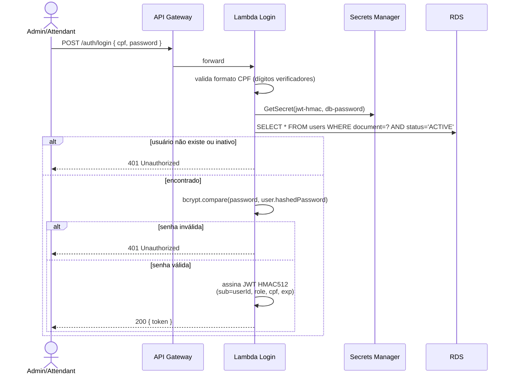
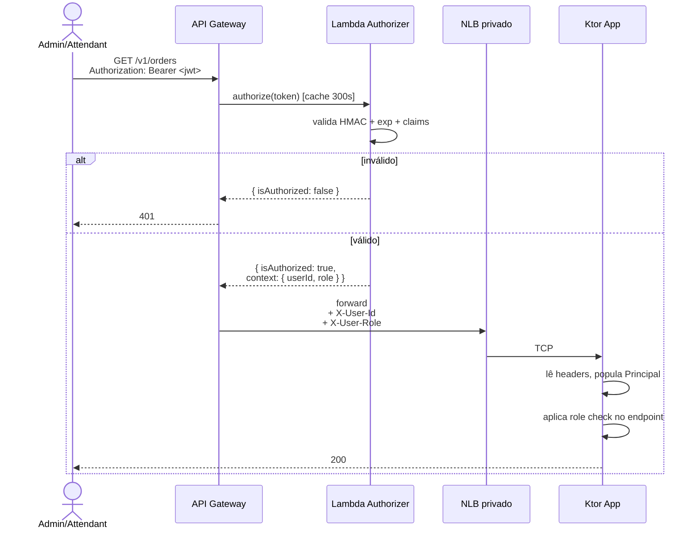
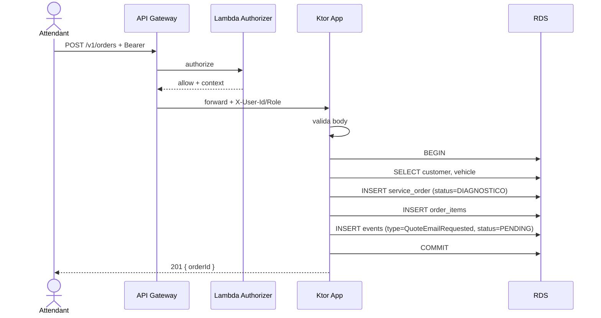
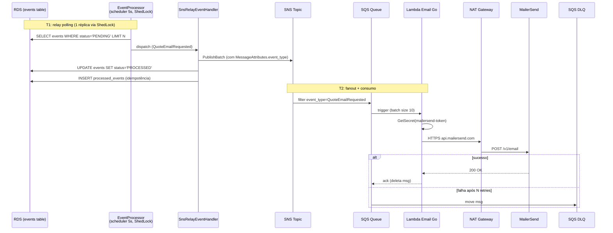
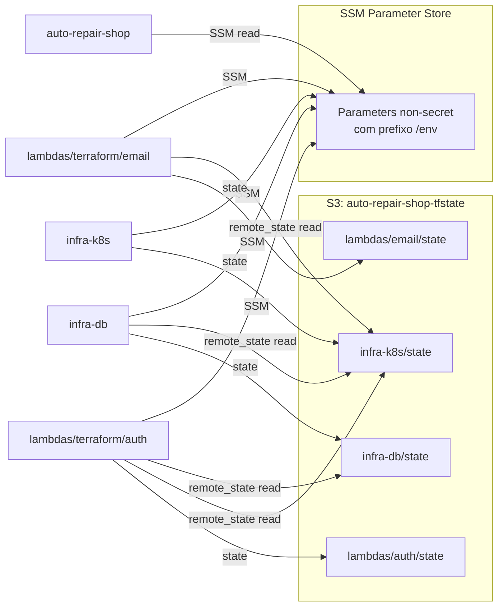
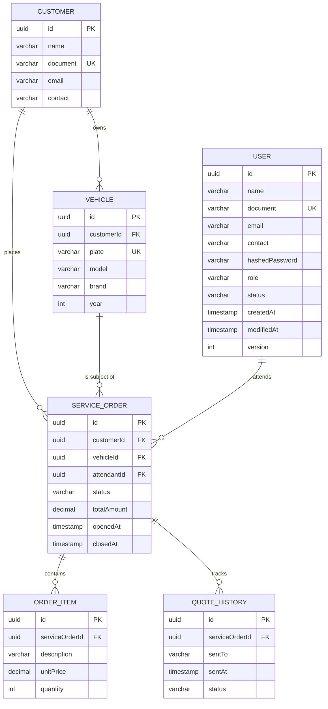

# Tech Challenge — Plataforma Cloud, Observabilidade e Multi-Repo

**Data:** 2026-05-13
**Autor:** Ivan
**Status:** Aprovado

---

## 1. Contexto

O `auto-repair-shop` é um sistema de gestão de oficina mecânica em Kotlin/Ktor com arquitetura hexagonal multi-módulo, atualmente rodando como monorepo em AWS (EKS + RDS via Terraform + GitHub Actions). Já implementa **transactional outbox** internamente via tabelas `events`/`commands` + `EventProcessor` agendado (a cada 5s) + ShedLock + tabela `processed_events` para idempotência.

A próxima fase da pós-graduação (Tech Challenge) exige elevar a aplicação a operação corporativa, com foco em:

- Segurança via API Gateway + autenticação serverless
- Multi-repo com CI/CD por componente
- Notificações assíncronas via SNS + SQS + Lambda dedicada, reaproveitando o outbox existente
- Observabilidade completa (métricas, logs, traces, alertas)
- Documentação arquitetural formal (RFCs, ADRs, ER, diagramas)

## 2. Objetivos

1. Implementar API Gateway protegendo rotas sensíveis com autenticação CPF+senha via Lambda
2. Segregar o monorepo em **4 repositórios** independentes com pipelines próprios (alinhado ao enunciado: `lambdas`, `infra-k8s`, `infra-db`, `app`)
3. Provisionar infra como código (Terraform) com estado compartilhado
4. Stack de observabilidade open-source rodando dentro do cluster
5. Extrair envio de email para Lambda Go dedicada (em VPC, egress via NAT) com fluxo assíncrono via SNS/SQS reaproveitando o outbox interno; mantém MailerSend como provedor. As Lambdas (login, authorizer, email) convivem no mesmo repo (monorepo Go) com Terraform state separado por sub-projeto.
6. Documentação arquitetural completa em Mermaid + Markdown

## 3. Restrições

- **AWS Academy:** session tokens expiram a cada 4h, refresh manual dos GitHub Secrets
- **Custo:** 1 cluster EKS + 1 RDS, ambientes separados por namespace e database
- **Time:** solo, sem prazo rígido — qualidade arquitetural prioritária
- **Domínio:** modificações no app devem respeitar a arquitetura hexagonal existente

## 4. Visão arquitetural

```mermaid
flowchart LR
    subgraph Internet
        Client[Cliente / Postman]
        MS[MailerSend API]
    end

    subgraph AWS["AWS Account"]
        APIGW["API Gateway HTTP API<br/>(stages hml/prod)"]
        SNS["SNS Topics<br/>events-hml, events-prod"]
        SQS["SQS Queues<br/>email-queue-hml/prod + DLQ"]

        subgraph VPC["VPC compartilhada"]
            NAT["NAT Gateway"]
            subgraph PrivSubnets["Subnets privadas"]
                LambdaLogin["Lambda Go<br/>login handler"]
                LambdaAuth["Lambda Go<br/>authorizer handler"]
                LambdaEmail["Lambda Go<br/>email handler"]
                RDS[("RDS PostgreSQL<br/>databases: hml, prod")]
                Secrets["Secrets Manager<br/>jwt-hmac, db-password,<br/>mailersend-token"]
            end
            subgraph EksSubnets["Subnets EKS"]
                NLB["NLB interno"]
                subgraph EKS["EKS cluster"]
                    AppHml["App ns: hml"]
                    AppProd["App ns: prod"]
                    Obs["ns: observability<br/>Prometheus, Grafana,<br/>Loki, Tempo, OTel"]
                end
            end
        end
    end

    Client -->|HTTPS| APIGW
    APIGW -->|invoke| LambdaAuth
    APIGW -->|POST /auth/login| LambdaLogin
    APIGW -->|"VPC Link v2<br/>(autenticadas)"| NLB
    NLB --> AppProd
    NLB --> AppHml
    LambdaLogin --> RDS
    LambdaLogin --> Secrets
    LambdaAuth --> Secrets
    AppHml --> RDS
    AppProd --> RDS
    AppProd -->|outbox relay<br/>sns:Publish| SNS
    AppHml -->|outbox relay<br/>sns:Publish| SNS
    SNS -->|filter event_type| SQS
    SQS -->|trigger| LambdaEmail
    LambdaEmail --> Secrets
    LambdaEmail -->|HTTPS via NAT| NAT
    NAT --> MS
```



### 4.1 Fluxo de autenticação (CPF + senha)



### 4.2 Fluxo de request autenticado



### 4.3 Diagrama de sequência — abertura de OS



### 4.4 Fluxo de notificação via outbox + SNS + SQS + Lambda email



**Garantias do fluxo:**
- **At-least-once delivery**: se o relay publicar no SNS mas crashar antes do UPDATE, o evento é re-publicado no próximo poll (idempotência fica por conta do Lambda + MailerSend Idempotency-Key)
- **No SNS lost-after-commit**: como o INSERT em `events` está na mesma TX do `INSERT service_order`, ou tudo persiste ou nada
- **ShedLock garante 1 publisher**: múltiplas réplicas do app não duplicam
- **DLQ para envenenamento**: msg que falha 5x vai pra DLQ e dispara alerta

## 5. Repositórios

### 5.1 Mapa de responsabilidades

| Repo | Conteúdo |
|------|----------|
| `auto-repair-shop` (existente) | App Kotlin + Dockerfile + Kustomize K8s manifests + outbox relay publicando em SNS |
| `auto-repair-shop-lambdas` (novo) | **Monorepo Go**: 3 Lambdas (login, authorizer, email) com código `internal/` compartilhado + 2 Terraform sub-projetos com state separado (`terraform/auth/`, `terraform/email/`) |
| `auto-repair-shop-infra-k8s` (novo) | Terraform VPC + EKS + AWS LB Controller + observability via Helm |
| `auto-repair-shop-infra-db` (novo) | Terraform RDS + databases hml/prod + Secrets Manager (db password) |

### 5.2 Tabela de componentes Terraform

| Componente | Repo | Por que ali |
|------------|------|-------------|
| VPC, subnets, IGW, NAT, route tables | `infra-k8s` | Fundação de rede compartilhada por EKS, RDS e Lambda |
| EKS cluster + node group + OIDC provider | `infra-k8s` | Compute principal; OIDC é pré-req do LB Controller |
| AWS Load Balancer Controller (Helm) | `infra-k8s` | Provisiona NLB privado a partir de annotations do Service |
| Helm: kube-prometheus-stack, Loki, Tempo, OTel | `infra-k8s` | Stack roda dentro do cluster |
| Namespaces (hml, prod, observability) | `infra-k8s` | Pré-requisito do deploy da app |
| Security Group da Lambda | `infra-k8s` | Permite `infra-db` liberar ingresso sem dep circular |
| RDS instance + parameter group + subnet group | `infra-db` | Requisito do enunciado: repo próprio do banco |
| Security Group do RDS | `infra-db` | Lê EKS SG e Lambda SG via remote_state |
| Databases `auto_repair_shop_hml` e `auto_repair_shop_prod` | `infra-db` | Provider `postgresql`, após RDS up |
| Users de aplicação `app_hml` e `app_prod` (Postgres) | `infra-db` | Cada user só tem GRANT no DB do próprio env (isolamento real) |
| **2 secrets** `db-password-hml` e `db-password-prod` (Secrets Manager) | `infra-db` | Containers Terraform com `lifecycle.ignore_changes`; valores vêm de GitHub Secrets (controle manual de rotação); senhas distintas por env |
| Lambda Functions login + authorizer (× 2 envs = 4 funções) + execution roles | `lambdas/terraform/auth` | Co-localização com o código Go |
| API Gateway HTTP API + 2 stages (hml/prod) | `lambdas/terraform/auth` | Porta de entrada do auth service |
| API Gateway Authorizer (resource apontando para Lambda authorizer por env) | `lambdas/terraform/auth` | Acoplado ao API Gateway do mesmo sub-projeto |
| VPC Link v2 | `lambdas/terraform/auth` | Liga API GW ao NLB; lê subnets via remote_state |
| `jwt-hmac-hml`, `jwt-hmac-prod` (Secrets Manager) | `lambdas/terraform/auth` | Containers Terraform com `lifecycle.ignore_changes`; valores vêm de GitHub Secrets (rotação manual); 1 por env |
| Lambda permission (API GW → invoke) | `lambdas/terraform/auth` | Acoplada à integração |
| **2 SNS Topics** `auto-repair-shop-events-hml` e `-prod` | `lambdas/terraform/email` | Owner dos tópicos de eventos externos; nome convencional pra resolver IAM cross-repo; 1 por env evita cross-env leak |
| **2 SQS Queues** `email-queue-hml/prod` + DLQs | `lambdas/terraform/email` | Subscribers dos SNS topics; isola consumo por env |
| SNS → SQS Subscriptions com filter policy (× 2 envs) | `lambdas/terraform/email` | Filtra `MessageAttributes.event_type` |
| **2 Lambdas Email** (hml + prod, Go, VPC config, NAT egress) | `lambdas/terraform/email` | Co-localização com código; em VPC pra postura "interna"; alcança MailerSend via NAT existente |
| Lambda execution role + IAM policy (× 2 envs) | `lambdas/terraform/email` | Permite consumir SQS, ler Secrets Manager, logs CloudWatch |
| `mailersend-token` secret (Secrets Manager, 1 só) | `lambdas/terraform/email` | Container criado por Terraform; valor injetado pelo CI a partir de GitHub Secret (`ignore_changes`); compartilhado entre envs |
| SQS event source mapping → Lambda (× 2) | `lambdas/terraform/email` | Trigger da Lambda pelo SQS |
| IRSA policy: `sns:Publish` para o app | `infra-k8s` | Permissão pro pod EKS publicar no tópico do env via convention de nome (`auto-repair-shop-events-*`) |

### 5.3 Estrutura interna — repo `auto-repair-shop` (existente, ajustado)

```
auto-repair-shop/
├── main/, api/, domain/, storage/, worker/, jwt/, email/
├── infra/k8s/
│   ├── base/
│   │   ├── kustomization.yaml
│   │   ├── deployment.yaml
│   │   ├── service.yaml             # NLB privado via annotations
│   │   ├── configmap.yaml
│   │   ├── hpa.yaml
│   │   └── servicemonitor.yaml
│   └── overlays/
│       ├── hml/
│       │   ├── kustomization.yaml
│       │   ├── namespace.yaml
│       │   ├── deployment-patch.yaml
│       │   └── configmap-patch.yaml
│       └── prod/ (idem)
├── Dockerfile
├── .github/workflows/{pr-check.yaml, deploy.yaml}
└── docs/architecture/               # docs cross-cutting moram aqui
```

**Mudanças no código Kotlin:**
- `jwt/` módulo: simplificado. Remove `generate(...)` e `validate(...)` JWT. Cria `HeaderAuthenticationProvider` que lê `X-User-Id` e `X-User-Role` e popula `Principal`
- Remove rotas de login da `api/` (movem pra Lambda)
- Adiciona `micrometer-registry-prometheus` para expor `/metrics`
- Logback em JSON com `logstash-logback-encoder`, MDC com `traceId`/`spanId` via `opentelemetry-ktor`
- Flyway migration (próxima versão disponível, ex.: `V{N}__add_user_status.sql`): `ALTER TABLE users ADD COLUMN status VARCHAR(20) NOT NULL DEFAULT 'ACTIVE';`
- **Reaproveitamento do outbox existente** (sem nova tabela, sem novo scheduler):
  - Adiciona `SnsRelayEventHandler` no `worker/` que recebe `DomainEvent`, serializa em JSON e publica em SNS com `MessageAttributes.event_type`
  - Configuração DI (Koin): registrar quais `DomainEvent` vão para SNS (ex.: `QuoteEmailRequestedEvent` → SNS; `OrderInProgressEvent` → local)
  - `DefaultEventPublisher`: para eventos com flag `external=true`, pula o despacho in-memory e deixa para o scheduler (evita publish antes do COMMIT)
  - `EventProcessorTask` continua o relay; `SnsRelayEventHandler` é só mais um handler na lista
  - Idempotência via `processed_events` (já existe) garante "exactly-once effective" mesmo com retries
- Remove módulo `email/` inteiro (código migra para a Lambda Go)
- Cria novo `DomainEvent`: `QuoteEmailRequestedEvent(orderId, customerEmail, customerName, totalAmount, items)`
- Substitui `SendQuoteToClientCommand` (que chamava MailerSend) por publicação do `QuoteEmailRequestedEvent`
- Nova dependência: `software.amazon.awssdk:sns` para publicar no tópico
- IRSA: pod usa service account com role que permite `sns:Publish` no tópico `auto-repair-shop-events`

### 5.4 Estrutura interna — repo `auto-repair-shop-lambdas` (monorepo Go)

```
auto-repair-shop-lambdas/
├── cmd/
│   ├── login/main.go               # POST /auth/login
│   ├── authorizer/main.go          # API GW request authorizer v2.0
│   └── email/main.go               # SQS consumer → MailerSend
├── internal/
│   ├── jwt/                        # signer (login) + verifier (authorizer)
│   ├── secrets/                    # AWS SDK Secrets Manager — usado por todos
│   ├── observability/              # OTel + slog JSON + traceparent propagation
│   ├── user/repository.go          # SELECT users WHERE document=? AND status='ACTIVE'
│   ├── cpf/validate.go             # dígitos verificadores (login)
│   ├── password/bcrypt.go          # bcrypt compare (login)
│   ├── mailersend/client.go        # HTTP client MailerSend (email)
│   ├── template/quote.go           # template HTML/texto (email)
│   └── model/event.go              # QuoteEmailRequestedEvent struct (email)
├── terraform/
│   ├── auth/                       # state separado: lambdas/auth/terraform.tfstate
│   │   ├── backend.tf
│   │   ├── data.tf                 # remote_state (infra-k8s, infra-db)
│   │   ├── lambda.tf               # 2 Lambda functions × 2 envs = 4 funções
│   │   ├── apigw.tf                # HTTP API + 2 stages (hml/prod) + Authorizer + VPC Link
│   │   ├── secrets.tf              # 2 jwt-hmac containers (hml + prod) com ignore_changes; valores via CI a partir de GitHub Secrets
│   │   ├── outputs.tf
│   │   └── variables.tf            # environment, etc
│   ├── email/                      # state separado: lambdas/email/terraform.tfstate
│   │   ├── backend.tf
│   │   ├── data.tf                 # remote_state (infra-k8s)
│   │   ├── sns.tf                  # 2 tópicos: events-hml, events-prod
│   │   ├── sqs.tf                  # 2 queues + DLQ por env
│   │   ├── subscription.tf         # SNS → SQS com FilterPolicy event_type
│   │   ├── lambda.tf               # 2 Lambdas Email (hml/prod), VPC config
│   │   ├── iam.tf
│   │   ├── secrets.tf              # mailersend-token (container; valor via CI; ignore_changes)
│   │   ├── eventsource.tf          # SQS → Lambda event source mapping
│   │   └── outputs.tf
│   └── shared/                     # (opcional, vazio inicialmente)
├── tests/
├── .github/workflows/
│   ├── pr-check.yaml               # go test/lint em tudo; tf plan por sub-projeto
│   └── deploy.yaml                 # path-filter: deploya só o que mudou
├── go.mod, go.sum, Makefile
└── README.md
```

**Por que monorepo Go com Terraform state separado:**
- Código `internal/` compartilhado entre Lambdas (JWT, secrets, observability) sem duplicação
- Pipelines unificados (1 lint, 1 test framework)
- Atomicidade pra mudanças cross-Lambda (ex.: instrumentação OTel)
- Mas state Terraform separado por sub-projeto (`terraform/auth/` vs `terraform/email/`) preserva o **blast radius pequeno** — mudança em `cmd/email/` não pode quebrar a infra do auth
- Alinha com o enunciado que lista "Lambda (Function Serverless)" como item singular

**Notas operacionais:**
- Todas as Lambdas em VPC, subnets privadas, SG criado em `infra-k8s`. Email sai pra MailerSend via NAT.
- Cliente MailerSend com `Idempotency-Key=event.id` evita duplicação em re-entregas SQS.
- DLQ alarmada por `ApproximateNumberOfMessagesVisible > 0` no Alertmanager.
- Reserved concurrency do email Lambda limitada (ex.: 10) pra não esgotar TPS do MailerSend.
- Por env: 2 sets independentes de recursos (login-hml, login-prod, authorizer-hml, authorizer-prod, email-hml, email-prod). Branch `develop` → apply com `-var environment=hml`; `main` → `prod`.

**SSM publicado (por env):**
- `/auto-repair-shop/{env}/sns/events-topic-arn`
- `/auto-repair-shop/{env}/sqs/email-queue-arn`
- `/auto-repair-shop/{env}/apigw/endpoint`

### 5.5 Estrutura interna — repo `auto-repair-shop-infra-k8s`

```
auto-repair-shop-infra-k8s/
├── backend.tf
├── providers.tf
├── main.tf
├── variables.tf
├── outputs.tf
├── modules/
│   ├── vpc/
│   ├── eks/
│   ├── alb-controller/
│   ├── namespaces/
│   └── observability/
├── helm-values/
│   ├── kube-prometheus-stack.yaml
│   ├── loki.yaml
│   ├── tempo.yaml
│   └── otel-collector.yaml
├── .github/workflows/{pr-check.yaml, deploy.yaml}
└── README.md
```

**Outputs publicados em SSM Parameter Store:**
- `/auto-repair-shop/eks/cluster-name`
- `/auto-repair-shop/network/vpc-id`
- `/auto-repair-shop/network/private-subnet-ids`
- `/auto-repair-shop/network/lambda-sg-id`

### 5.6 Estrutura interna — repo `auto-repair-shop-infra-db`

```
auto-repair-shop-infra-db/
├── backend.tf
├── data.tf                      # terraform_remote_state (infra-k8s)
├── main.tf
├── modules/rds/                 # RDS instance (master user) + SG + subnet group + parameter group
├── databases.tf                 # provider postgresql cria 2 databases: auto_repair_shop_hml/prod
├── users.tf                     # cria app_hml e app_prod com GRANT só no DB do próprio env
├── secrets.tf                   # 2 Secrets Manager containers (db-password-hml/prod); lifecycle.ignore_changes; valores via CI a partir de GitHub Secrets
├── outputs.tf
├── .github/workflows/{pr-check.yaml, deploy.yaml}
└── README.md
```

**Isolamento por env:**
- `app_hml@auto_repair_shop_hml` — só consegue ler/escrever no DB hml
- `app_prod@auto_repair_shop_prod` — só consegue ler/escrever no DB prod
- Master user só pra admin/migration; senha rotacionada separadamente

**SSM Parameter Store:**
- `/auto-repair-shop/db/endpoint`
- `/auto-repair-shop/db/port`
- `/auto-repair-shop/{env}/db/secret-arn` (1 entrada por env apontando pro Secrets Manager correto)
- `/auto-repair-shop/{env}/db/username` (`app_hml` ou `app_prod`)
- `/auto-repair-shop/{env}/db/name` (`auto_repair_shop_hml` ou `auto_repair_shop_prod`)

### 5.7 Service registry entre repos



- **`terraform_remote_state`** entre repos Terraform (lock, outputs tipados)
- **SSM Parameter Store** para o repo da app (não usa Terraform)

### 5.8 Ordem de bootstrap inicial

1. `infra-k8s` — cria VPC, EKS, observability stack
2. `infra-db` — lê VPC, cria RDS + databases hml/prod + 2 app users + 2 secrets
3. `lambdas` (sub-projeto `terraform/auth/`) — lê VPC/SG e endpoint do DB, cria Lambdas login/authorizer + API GW + VPC Link (deploy de cada env via branch correspondente)
4. `lambdas` (sub-projeto `terraform/email/`) — lê VPC/SG, cria Lambda email + SNS topics + SQS queues + DLQ (deploy por env)
5. `auto-repair-shop` — deploya em namespace correspondente à branch (`develop` → hml; `main` → prod)

## 6. Observabilidade

### 6.1 Stack (Helm releases em `ns: observability`)

| Componente | Chart | Função |
|------------|-------|--------|
| Prometheus + Alertmanager + kube-state-metrics + node-exporter | `kube-prometheus-stack` | Métricas + alertas |
| Grafana | bundled | UI única (métricas, logs, traces) |
| Loki + Promtail | `loki-stack` | Logs JSON agregados |
| Tempo | `tempo` | Tracing distribuído (OTLP) |
| OTel Collector | `opentelemetry-collector` | Recebe OTLP da app e Lambda |
| Blackbox Exporter | `prometheus-blackbox-exporter` | Uptime probes |
| cloudwatch-exporter | OSS chart | Traduz métricas API GW + Lambda do CloudWatch |

### 6.2 Cobertura do enunciado

| Exigência | Implementação |
|-----------|---------------|
| Latência das APIs | Micrometer no Ktor (`http_server_requests_seconds`) + cloudwatch-exporter (API GW Latency) |
| Consumo K8s (CPU/mem) | kube-state-metrics, node-exporter, cAdvisor — dashboards prontos |
| Healthchecks/uptime | Liveness/readiness probes + Blackbox Exporter probando `/v1/health` |
| Alertas | PrometheusRule CRD + Alertmanager → webhook Discord |
| Logs JSON + correlação | Logback `logstash-logback-encoder` + OTel MDC + Promtail → Loki |
| Volume diário de OS | Counter `orders_created_total` (Micrometer) |
| Tempo médio por status | Timer `order_duration_seconds` por transição |
| Erros nas integrações | Counter `email_send_failures_total` (publicado pela Lambda email via OTel) |
| **Saúde do outbox** | Gauge `outbox_pending_count`, `outbox_age_oldest_seconds`; alerta se pending > 100 por > 5min |
| **DLQ do SQS** | `aws_sqs_queue` métrica `ApproximateNumberOfMessagesVisible` via cloudwatch-exporter; alarme se > 0 |
| **Throughput Lambda email** | CloudWatch Lambda `Duration`, `Invocations`, `Errors`, `Throttles` via cloudwatch-exporter |

### 6.3 Tracing distribuído

- OTel SDK no Lambda (Go): `otellambda` middleware injeta span context
- OTel no Ktor: plugin `opentelemetry-ktor`
- Propagação via header `traceparent` (W3C)
- OTel Collector recebe spans → Tempo
- Grafana exibe trace consolidado Lambda + App + RDS

### 6.4 Logs estruturados (formato)

```json
{
  "@timestamp": "2026-05-13T10:23:11.234Z",
  "level": "INFO",
  "message": "Order created",
  "traceId": "5f1d3a...",
  "spanId": "a3b2c1...",
  "requestId": "f9e8d7...",
  "orderId": "uuid"
}
```

Labels no Loki: `namespace`, `app`, `level`.

### 6.5 Dashboards Grafana

Provisionados como ConfigMap com label `grafana_dashboard=1`, salvos em `helm-values/grafana-dashboards/`.

- **Dashboard 1 — Operação:** volume de OS, status, tempos, erros MailerSend
- **Dashboard 2 — Infraestrutura:** built-in kube-prometheus-stack
- **Dashboard 3 — API GW + Lambdas:** latência por rota, cold starts, throttling, errors
- **Dashboard 4 — Outbox & Messaging:** outbox pending count, age oldest pending, SNS publishes/min, SQS in-flight, DLQ size

### 6.6 Regras de alerta

```yaml
- alert: OrderProcessingFailureRate
  expr: sum(rate(order_processing_errors_total[5m])) / sum(rate(orders_processed_total[5m])) > 0.05
  for: 5m
- alert: APIHighLatencyP95
  expr: histogram_quantile(0.95, rate(http_server_requests_seconds_bucket[5m])) > 1
  for: 10m
- alert: APIGatewayDown
  expr: probe_success{job="blackbox-apigw"} == 0
  for: 2m
- alert: PodRestartLooping
  expr: rate(kube_pod_container_status_restarts_total[15m]) > 0.1
- alert: OutboxBacklog
  expr: outbox_pending_count > 100
  for: 5m
  labels: { severity: warning }
- alert: EmailDLQNotEmpty
  expr: aws_sqs_approximate_number_of_messages_visible{queue=~".*email-dlq.*"} > 0
  for: 1m
  labels: { severity: critical }
```

## 7. CI/CD

### 7.1 Branch strategy

| Repo | Branches | Deploy |
|------|----------|--------|
| `auto-repair-shop` | main + develop + features | develop → ns hml; main → ns prod |
| `lambdas` | main + develop + features | develop → recursos `*-hml`; main → `*-prod`. Path-filter por sub-projeto (`terraform/auth/` vs `terraform/email/`) |
| `infra-k8s` | main + features | main → tf apply (env único — recursos compartilhados) |
| `infra-db` | main + features | main → tf apply (cria 2 databases + 2 users + 2 secrets de uma vez) |

### 7.2 Branch protection (todos os repos)

- PR obrigatório antes de merge
- Required approving reviews: 0 (projeto solo — satisfaz "uso obrigatório de PRs")
- Required status checks: `pr-check`
- Block force push, block delete
- Sem bypass para admin

### 7.3 Pipelines por repo

**`auto-repair-shop`:**
- `pr-check`: gradle test + integrationTest + jacoco + kustomize lint
- `deploy`: build image → push GHCR → ler SSM (cluster, RDS endpoint, secrets) → `kubectl apply -k overlays/$ENV` → smoke test via API GW

**`lambdas` (monorepo Go):**
- `pr-check`: `go vet ./...` + `go test ./... -race -cover` + `golangci-lint run` + `terraform plan` em `terraform/auth/` e `terraform/email/`
- `deploy`: path-filter detecta o que mudou e dispara matrix
  - mudança em `cmd/login/`, `cmd/authorizer/`, `internal/jwt|user|cpf|password/`, `terraform/auth/` → build binários + zip + `terraform apply -chdir=terraform/auth -var environment=$ENV` → publica `apigw/endpoint` no SSM → smoke test
  - mudança em `cmd/email/`, `internal/mailersend|template|model/`, `terraform/email/` → idem `terraform/email` → publica `sns/topic-arn` e `sqs/queue-arn` no SSM
  - mudança em `internal/secrets|observability/` (compartilhados) → deploya **TUDO** (correto, garante consistência)
- Build: `GOOS=linux GOARCH=arm64 CGO_ENABLED=0 go build -tags lambda.norpc -o bootstrap ./cmd/$LAMBDA` → zip → upload
- Runtime: `provided.al2023`

**`infra-k8s` e `infra-db`:**
- `pr-check`: terraform fmt + validate + plan
- `deploy`: `terraform apply` (só main) → publica outputs no SSM

### 7.4 Gestão de segredos

Política: **GitHub Secrets são o source-of-truth de valores; Secrets Manager é cache de runtime sincronizado pelo CI**. Terraform cria os containers (`aws_secretsmanager_secret`) com `lifecycle.ignore_changes = [secret_string]`. O job de deploy roda `aws secretsmanager put-secret-value` com o valor vindo do GitHub Secret após cada apply, garantindo que o valor atual sempre esteja sincronizado. Operador rotaciona setando o GitHub Secret e re-disparando o pipeline.

| Segredo (Secrets Manager) | GitHub Secret de origem | Repo do GitHub Secret | Quem lê o valor de runtime |
|---------------------------|--------------------------|----------------------|----------------------------|
| `db-password-hml` | `DB_PASSWORD_HML` | `infra-db` | App pod (ns hml) + Lambda login (env=hml) |
| `db-password-prod` | `DB_PASSWORD_PROD` | `infra-db` | App pod (ns prod) + Lambda login (env=prod) |
| `jwt-hmac-hml` | `JWT_HMAC_HML` | `lambdas` | Lambda login + authorizer (env=hml) |
| `jwt-hmac-prod` | `JWT_HMAC_PROD` | `lambdas` | Lambda login + authorizer (env=prod) |
| `mailersend-token` | `MAILERSEND_TOKEN` | `lambdas` | Lambda email (ambos os envs — token compartilhado) |

**GitHub Secrets por repo:**

| Secret | App | Lambdas | Infra-k8s | Infra-db |
|--------|:---:|:-------:|:---------:|:--------:|
| `AWS_ACCESS_KEY_ID` | ✓ | ✓ | ✓ | ✓ |
| `AWS_SECRET_ACCESS_KEY` | ✓ | ✓ | ✓ | ✓ |
| `AWS_SESSION_TOKEN` | ✓ | ✓ | ✓ | ✓ |
| `GHCR_PAT` | ✓ | | | |
| `DB_PASSWORD_HML` | | | | ✓ |
| `DB_PASSWORD_PROD` | | | | ✓ |
| `JWT_HMAC_HML` | | ✓ | | |
| `JWT_HMAC_PROD` | | ✓ | | |
| `MAILERSEND_TOKEN` | | ✓ | | |

**Como rotacionar uma senha (operacional):**
1. `gh secret set DB_PASSWORD_HML --repo ivanzao/auto-repair-shop-infra-db` (novo valor)
2. Disparar manualmente o workflow `deploy.yaml` do `infra-db`
3. CI roda `aws secretsmanager put-secret-value` → atualiza o valor
4. Pods da app no namespace `hml` precisam de reload — `kubectl rollout restart deployment` no namespace hml (a senha é lida na inicialização e cacheada). Lambdas leem on-demand via SDK (próxima invocação pega a nova).

## 8. Documentação arquitetural

### 8.1 Organização

Toda documentação cross-cutting mora em `auto-repair-shop/docs/architecture/`. Repos auxiliares têm README local com diagrama do seu escopo + link pra cá.

```
docs/architecture/
├── README.md                            # índice
├── diagrams/
│   ├── 01-component-overview.md
│   ├── 02-deployment-aws.md
│   ├── 03-sequence-auth.md
│   ├── 04-sequence-authorize-request.md
│   ├── 05-sequence-create-order.md
│   ├── 06-sequence-outbox-email-notification.md
│   └── 07-er-model.md
├── rfcs/
│   ├── RFC-001-cloud-aws.md
│   ├── RFC-002-database-postgresql.md
│   ├── RFC-003-auth-cpf-password.md
│   └── RFC-004-observability-stack.md
├── adrs/
│   ├── ADR-001-api-gateway-vpc-link-nlb.md
│   ├── ADR-002-lambda-authorizer-header-injection.md
│   ├── ADR-003-helm-vs-kustomize.md
│   ├── ADR-004-terraform-state-and-ssm-registry.md
│   ├── ADR-005-hpa-config.md
│   ├── ADR-006-multi-env-single-cluster-namespaces.md
│   ├── ADR-007-secrets-github-as-source-of-truth.md
│   ├── ADR-008-lambda-go-provided-al2023.md
│   ├── ADR-009-lambdas-monorepo-with-separate-tf-state.md
│   ├── ADR-010-outbox-via-existing-events-table.md
│   └── ADR-011-db-credentials-per-environment.md
└── database/
    └── modelo-relacional.md
```

### 8.2 RFCs (proposta deliberativa)

| ID | Tema | Recomendação |
|----|------|--------------|
| RFC-001 | Cloud | AWS (Academy, EKS, RDS, Lambda, API GW) |
| RFC-002 | Banco | PostgreSQL 16 em RDS (transações, JSONB, ecossistema Exposed/Flyway) |
| RFC-003 | Auth | CPF + senha via Lambda; bcrypt; JWT HMAC512; Lambda Authorizer com header injection |
| RFC-004 | Observabilidade | Stack open-source no cluster (Prometheus, Loki, Tempo, Grafana) |

### 8.3 ADRs (registro de decisão)

| ID | Decisão |
|----|---------|
| ADR-001 | API Gateway HTTP API + VPC Link v2 + NLB privado |
| ADR-002 | Lambda Authorizer com `context` → headers `X-User-Id` e `X-User-Role` |
| ADR-003 | Helm pra software de terceiros, Kustomize pra YAMLs próprios |
| ADR-004 | S3 backend único + SSM como service registry inter-repo |
| ADR-005 | HPA target 70% CPU, min 2 / max 4 réplicas em prod (hml: 1/2) |
| ADR-006 | Multi-ambiente via namespaces no mesmo cluster + databases separados no mesmo RDS — inclui análise senior architect (VPCs separadas seriam padrão ouro) vs senior DevOps (custo+operabilidade), com mitigações via NetworkPolicy, ResourceQuota, IRSA per-namespace |
| ADR-007 | Gestão de segredos: GitHub Secrets são source-of-truth, sincronizados pelo CI no AWS Secrets Manager (`lifecycle.ignore_changes`). Habilita rotação manual sem `terraform taint` |
| ADR-008 | Lambdas em Go com custom runtime `provided.al2023` |
| ADR-009 | **Lambdas em monorepo Go** (`auto-repair-shop-lambdas`) com Terraform state separado por sub-projeto (`terraform/auth/`, `terraform/email/`); pipeline com path-filter |
| ADR-010 | **Outbox pattern reaproveitando tabela `events` existente** + `EventProcessor` agendado + ShedLock + `processed_events`; novo `SnsRelayEventHandler` publica em SNS apenas eventos com flag `external` |
| ADR-011 | Credenciais de DB distintas por env (`db-password-hml` ≠ `db-password-prod`); cada Postgres user com GRANT só no DB do próprio env |

### 8.4 Modelo relacional (rascunho ER)



> O ER acima é a proposta. Durante a execução do plano será reconciliado com o estado real das Flyway migrations e do código Kotlin para garantir aderência fiel.

### 8.5 READMEs por repo

Cada repo terá README com: propósito, tecnologias, passos de exec/deploy, diagrama da arquitetura específica daquele repo, link para Swagger/Postman.

### 8.6 Vídeo de demonstração (15 min)

| Minuto | Conteúdo |
|--------|----------|
| 0:00–1:00 | Visão geral da arquitetura |
| 1:00–2:30 | Tour pelos 4 repos |
| 2:30–4:00 | Pipeline CI/CD em execução (PR → merge → deploy) |
| 4:00–6:00 | Bootstrap completo: infra-k8s → infra-db → lambdas (auth + email) → app |
| 6:00–8:00 | Autenticação: login com CPF+senha retornando JWT; rota sem token (401); com token válido (200) |
| 8:00–9:00 | Criar ordem de serviço via API protegida |
| 9:00–10:30 | Fluxo de email assíncrono: outbox table → SNS → SQS → Lambda email → MailerSend; mostrar mensagem chegando |
| 10:30–13:00 | Dashboard Grafana ao vivo; gerar carga via K6; ver métricas e traces |
| 13:00–14:30 | Logs no Loki por `traceId`, mostrando Lambda + App no mesmo trace |
| 14:30–15:00 | Encerramento |

## 9. Riscos e mitigações

| Risco | Mitigação |
|-------|-----------|
| AWS Academy bloqueia algum recurso (VPC Link, OIDC, Secrets Manager, SES já confirmado bloqueado) | Validar cedo no infra-k8s; plano B: Kong Ingress no lugar de VPC Link |
| Cold start de Lambdas em VPC (~1-2s por ENI provisioning) | Authorizer com cache TTL 300s — só 1 cold por 5min; login/email são tolerantes a latência (não-interativos no caso do email) |
| Drift do estado Terraform com session expirada no meio do apply | Re-aplicar; lock S3 evita corrupção; documentar em README |
| Custo de observability stack em t3.medium | Limitar Loki/Tempo a 1Gi disk, retention 3 dias se apertar |
| Logs estruturados duplicando MDC entre Ktor e OTel | Validar no integration test que `traceId` aparece exatamente uma vez |
| `Authorizer` rejeitando JWT válido por relógio dessincronizado entre Lambda e App | NTP em ambos; aceitar 30s de skew no `exp` |
| Outbox: SNS publish bem-sucedido + crash antes do UPDATE → duplicação | Idempotência via `processed_events` + MailerSend `Idempotency-Key=event.id` |
| DLQ acumulando por bug persistente | Alarme `EmailDLQNotEmpty` (severity critical, 1min); reprocessamento manual via script |
| SNS topic publicado por convention de nome mas IRSA policy errada → 403 | E2E test no smoke do app: publica evento de teste em hml e valida que chegou no SQS |

## 10. Critérios de aceitação

- [ ] 4 repos criados (`auto-repair-shop`, `auto-repair-shop-lambdas`, `auto-repair-shop-infra-k8s`, `auto-repair-shop-infra-db`), compartilhados com `soat-architecture`
- [ ] Branch `main` (e `develop` nos repos app/lambdas) protegida em todos; PR obrigatório, status check `pr-check`, sem direct/force push
- [ ] CI/CD funcional em todos os 4 repos: PR check + deploy automático
- [ ] `terraform apply` em infra-k8s, infra-db, lambdas/auth e lambdas/email completa sem erro nos 2 envs
- [ ] App responde em `http://<apigw>/<env>/v1/health` em hml e prod
- [ ] `POST /auth/login { cpf, password }` retorna JWT válido (CPF inválido/inativo retorna 401)
- [ ] `GET /v1/orders` sem token retorna 401; com token válido retorna 200; com role insuficiente retorna 403
- [ ] Criar OS dispara fluxo de email: INSERT em `events` → SNS publish → SQS deliver → Lambda → MailerSend → email recebido
- [ ] DLQ vazia em fluxo normal; alerta `EmailDLQNotEmpty` dispara em cenário simulado
- [ ] Dashboards Grafana (Operação, Infra, API GW+Lambdas, Outbox+Messaging) mostram métricas em tempo real
- [ ] Trace de uma request aparece consolidado no Tempo (Lambda authorizer + App + RDS)
- [ ] Logs JSON pesquisáveis no Loki por `traceId`, com Lambda e App no mesmo trace
- [ ] Alerta de exemplo disparando no Alertmanager (simular falha)
- [ ] DBs separados por env (`auto_repair_shop_hml` e `_prod`); users isolados (`app_hml`/`app_prod`) com GRANT correto
- [ ] Senhas de DB e JWT distintas entre hml e prod; rotacionáveis via GitHub Secret + re-run do pipeline
- [ ] RFCs (4) e ADRs (11) escritos
- [ ] Diagramas Mermaid renderizando no GitHub (component overview, deployment, 4 sequence diagrams, ER)
- [ ] Vídeo de até 15 min publicado
- [ ] README em cada repo com propósito, tecnologias, exec/deploy, diagrama, link Swagger/Postman

## 11. Fora de escopo

- PDF final para o Portal do Aluno (responsabilidade do usuário)
- WAF na frente do API Gateway (não exigido pelo enunciado)
- mTLS entre serviços
- Multi-region / DR
- Cognito ou outro provedor OIDC
- VPCs separadas por env (analisado em ADR-006; fora de escopo por restrição de custo Academy)
- Migração de MailerSend → AWS SES (SES indisponível em Academy — investigado e confirmado)
- Cobertura de testes acima do baseline atual (foco em infra, não em tests novos da app)
