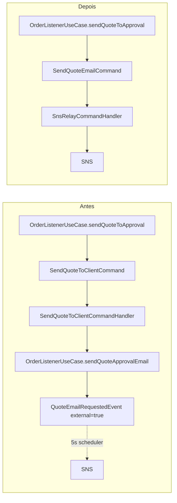

# SNS Command Refactor + Auth Bearer + MetricsPort

**Data:** 2026-05-23
**Autor:** Ivan
**Status:** Aprovado

---

## 1. Contexto

O `auto-repair-shop` está concluindo a migração para o modelo cloud (API Gateway + Lambda Authorizer + outbox publicando em SNS) descrito em `docs/superpowers/specs/2026-05-13-tech-challenge-cloud-platform-design.md`. A primeira passada introduziu:

- `QuoteEmailRequestedEvent` (DomainEvent, `external=true`) publicado em SNS via `SnsRelayEventHandler` no scheduler de eventos.
- `HeaderAuthenticationProvider` lendo `X-User-Id`/`X-User-Role` (premissa: API Gateway injeta headers).
- `OrderUseCase` importando `MeterRegistry` direto no domain.
- Overlays kustomize com `newTag: latest-hml`/`latest-prod`.
- `IntegrationTest` mockando `SnsClient` com `mockk(relaxed=true)` (sem validação real do que sai do app).

Estes pontos precisam de ajuste para alinhar com a arquitetura final.

## 2. Objetivos

1. Tratar o que trafega no tópico SNS como **comando** (intenção dirigida à Lambda de email), não evento de domínio.
2. Eliminar a indireção redundante (`SendQuoteToClientCommand` intermediário) e o atraso de 5s no happy path por causa do "skip external" no publisher.
3. Retirar o conceito genérico de `User` do app (admin e credenciais ficam blackboxed no Lambda). Substituir por `Attendant`, uma entidade de domínio enxuta que representa só o atendente.
4. Receber identidade do chamador via `Authorization: Bearer <jwt>` (não via headers customizados). Lambda Authorizer já validou o token; app decoda claims sem revalidar assinatura.
5. Tirar `io.micrometer.*` do `domain/`. Domain expõe `MetricsPort`; adapter Micrometer vive em novo módulo `metric/`.
6. Simplificar tag de imagem nos overlays (`latest` único, sem `-hml`/`-prod`).
7. Validar publicação real no SNS nos testes integrados via LocalStack, sem mock — assertions dentro do `OrderLifecycleIntegrationTest`.

## 3. Restrições

- Não introduzir novos repositórios; mudanças confinadas ao `auto-repair-shop`. Repo `auto-repair-shop-infra` não muda.
- Repo `auto-repair-shop-lambdas` (fora deste plan) precisa de follow-up: filter policy SNS→SQS atualizada para aceitar `event_type=SendQuoteEmailCommand`; Lambda admin assume a migration Flyway de `users`.
- Compatibilidade de dados em HML/PROD: ambientes Academy descartáveis; pode usar migrations destrutivas (DROP/RENAME).
- Mantém arquitetura hexagonal. Domain não conhece infraestrutura.

## 4. Visão geral das mudanças



## 5. Item 1 — `SendQuoteEmailCommand`

### 5.1 Domain

- `domain/.../command/model/Command.kt`: nada a adicionar. **Sem flag `external`** (YAGNI: o que diferencia "externo" é existir um `SnsRelayCommandHandler` registrado pro tipo).
- Renomeia e converte:
  - `domain/.../order/event/QuoteEmailRequestedEvent.kt` → `domain/.../order/command/SendQuoteEmailCommand.kt`
  - Passa a estender `Command` (com `id`, `createdAt`, `status: CommandStatus`).
  - Mantém payload: `orderId`, `callbackToken`, `customerEmail`, `customerName`, `totalAmount`, `services: List<Service>`, `supplies: List<Supply>`.
- Apaga:
  - `domain/.../order/command/SendQuoteToClientCommand.kt`
  - `domain/.../order/command/handler/SendQuoteToClientCommandHandler.kt`
  - `domain/.../event/model/DomainEvent.kt`: remove a propriedade `external` (não é mais usada).

### 5.2 `OrderListenerUseCase`

- Funde `sendQuoteToApproval(orderId)` e `sendQuoteApprovalEmail(orderId)` em um único método (`sendQuoteToApproval`) com uma TX:
  - lê order + supplies
  - calcula `totalServices + totalSupplies`
  - cria `OrderApprovalToken`
  - atualiza order para `waitingApproval()`
  - salva `SendQuoteEmailCommand` em `commands` (status `PENDING`)
- Fora da TX: `commandPublisher.publish(command)`.
- Drop deps: `eventRepository`, `eventPublisher`.

### 5.3 Worker

- Apaga `worker/.../messaging/SnsRelayEventHandler.kt`.
- Cria `worker/.../messaging/SnsRelayCommandHandler.kt`:
  ```kotlin
  class SnsRelayCommandHandler(
      private val sns: SnsClient,
      private val mapper: ObjectMapper,
  ) : CommandHandler {
      override val commandType: KClass<out Command> = SendQuoteEmailCommand::class

      override fun handle(command: Command) {
          if (command !is SendQuoteEmailCommand) return
          sns.publish(
              payload = mapper.writeValueAsString(command),
              eventType = "SendQuoteEmailCommand",
              messageId = command.id.toString(),
          )
      }
  }
  ```
- `DefaultEventPublisher`: remove o branch `if (event.external) return`. Sempre empurra para o `EventBus`.
- `DefaultCommandPublisher`: sem mudança (já empurra direto pro `CommandBus`).

### 5.4 Fluxo resultante

1. `OrderListenerUseCase.sendQuoteToApproval`: TX salva command PENDING + publica no bus.
2. `CommandConsumerWorker` consome bus → `CommandProcessor.process(command)`.
3. `CommandProcessor` chama `SnsRelayCommandHandler.handle` → `SnsClient.publish` no tópico real.
4. Sucesso → `commandRepository.updateStatus(id, PROCESSED)`. Falha → `FAILED`.
5. Crash entre passos 3 e 4: `CommandProcessorTask` (5s, ShedLock) re-publica do `PENDING`. Idempotência no destino via `Idempotency-Key=command.id` (Lambda email com MailerSend).

### 5.5 Follow-up no repo `auto-repair-shop-lambdas` (fora deste plan)

- Atualizar FilterPolicy da subscription SNS→SQS para aceitar `event_type=SendQuoteEmailCommand`.
- Atualizar struct `model/event.go` (ou renomear para `command.go`) e qualquer parsing de `event_type` no handler Go.

## 6. Item 2 — Drop `User`, criar `Attendant`, auth via JWT Bearer

### 6.1 Domain

Renomeia e reduz:

- `domain/.../user/` → `domain/.../attendant/`:
  - `Attendant(id, name, document, email, contact, createdAt, modifiedAt, version)` — **sem `hashedPassword`, sem `role`**.
  - `AttendantUseCase`, `AttendantRepository`.
  - `CreateAttendantRequest`, `UpdateAttendantRequest` (sem `password`, sem `role`).
  - `AttendantExceptions` (NotFound, AlreadyExists).
- Drop `domain/.../security/HashService.kt` (sem mais consumidores após drop do `UserUseCase`).

### 6.2 API

- `api/.../user/` → `api/.../attendant/`:
  - `AttendantRoutes`: `POST/GET/PUT/DELETE /v1/attendants`, todos sob `authenticate("admin")`.
  - DTOs renomeados; sem campo `password`/`role`.
- Drop `api/.../auth/HeaderAuthenticationProvider.kt`.
- Cria `api/.../auth/JwtBearerAuthenticationProvider.kt`:
  ```kotlin
  data class JwtUserPrincipal(val userId: UUID, val role: String)

  class JwtBearerAuthenticationProvider(config: Config) : AuthenticationProvider(config) {
      private val allowedRoles: Set<String> = config.allowedRoles
      // lê Authorization: Bearer <jwt>
      // decoda payload (Base64URL → JSON) sem validar assinatura (Lambda Authorizer já validou; NLB privado)
      // extrai sub → userId UUID, role → string
      // 401 se faltar/malformado; 403 se role fora do allowedRoles
      // popula JwtUserPrincipal no AuthenticationContext
  }

  fun AuthenticationConfig.jwtBearer(
      name: String? = null,
      configure: JwtBearerAuthenticationProvider.Config.() -> Unit = {},
  ) { ... }
  ```
- `config/AuthenticationConfiguration.kt`: registra duas configurações:
  - `jwtBearer("admin") { allowedRoles = setOf("ADMIN") }`
  - `jwtBearer("attendant") { allowedRoles = setOf("ATTENDANT", "ADMIN") }`
- Em `OrderRoutes` (e outros), `authenticate("attendant")` envolve criação de OS; controller extrai `attendantId` de `call.principal<JwtUserPrincipal>().userId`.

### 6.3 `Order` / `OrderUseCase`

- Domain `Order`: `attendant: User` → `attendantId: UUID`.
- `OrderResponseDTO`: campo `attendantId: UUID` (sem nested user fields).
- `OrderUseCase.create`:
  - Drop dep `userRepository` → adiciona `attendantRepository`.
  - Validação: `attendantRepository.findById(attendantId) ?: throw AttendantNotFoundException(attendantId)`.
  - Drop check `role == ATTENDANT` (todo registro em `attendants` é atendente por definição).
- `CreateOrderRequest`: drop campo `attendantId`. Controller passa a recebê-lo do principal.

### 6.4 Storage + Flyway

- `storage/.../user/` → `storage/.../attendant/`:
  - `Attendants` (tabela Exposed) + `AttendantPostgresRepository`.
- Flyway (uma migration nova):
  ```sql
  -- V{N}__rename_users_to_attendants.sql

  -- Drop FK em orders → users (se existir)
  ALTER TABLE orders DROP CONSTRAINT IF EXISTS orders_attendant_id_fkey;

  -- App não é mais dono de users (Lambda admin terá migration própria)
  DROP TABLE IF EXISTS users CASCADE;

  -- Cria attendants enxuto
  CREATE TABLE attendants (
      id           UUID PRIMARY KEY,
      name         VARCHAR(255) NOT NULL,
      document     VARCHAR(20)  NOT NULL UNIQUE,
      email        VARCHAR(255) NOT NULL UNIQUE,
      contact      VARCHAR(20)  NOT NULL,
      created_at   TIMESTAMP    NOT NULL DEFAULT NOW(),
      modified_at  TIMESTAMP    NOT NULL DEFAULT NOW(),
      version      INTEGER      NOT NULL DEFAULT 0
  );

  -- FK orders → attendants (mantém integridade no DB)
  ALTER TABLE orders
      ADD CONSTRAINT orders_attendant_id_fkey
      FOREIGN KEY (attendant_id) REFERENCES attendants(id);
  ```

### 6.5 Koin

- Remove bindings: `UserUseCase`, `UserRepository`, `HashService`.
- Adiciona: `AttendantUseCase`, `AttendantRepository`.

### 6.6 Testes

- Renomeia `main/.../test/.../user/` → `main/.../test/.../attendant/`:
  - `AttendantIntegrationTest`, `AttendantFixtures`.
- `IntegrationTest.adminHeaders()` deixa de seedar no DB e devolve headers sintéticos:
  ```kotlin
  fun adminHeaders(): Map<String, String> =
      mapOf("Authorization" to "Bearer ${fakeJwt(role = "ADMIN")}")

  fun attendantHeaders(attendantId: UUID = UUID.randomUUID()): Map<String, String> =
      mapOf("Authorization" to "Bearer ${fakeJwt(userId = attendantId, role = "ATTENDANT")}")

  // fakeJwt: monta header.{sub,role}.signature em Base64URL; signature pode ser literal "test"
  // (provider não revalida)
  ```
- Para testes que criam Order, primeiro cria um `Attendant` via repo, captura o UUID, usa em `attendantHeaders(id)`.

### 6.7 Provisionamento (out of scope deste plan)

- Sincronização entre app `attendants` (UUID + dados) e Lambda `users` (UUID + credenciais) fica como follow-up. Pode ser:
  - Admin endpoint no app cria `attendant` → script administrativo (CLI/Lambda) cria correspondente em `users` com mesmo UUID.
  - Ou Lambda admin único orquestrando ambos.
- Não é deste plan.

### 6.8 README e OpenAPI

- README: atualiza diagramas e exemplos (remove `X-User-Id`/`X-User-Role`; usa `Authorization: Bearer`).
- `api/src/main/resources/openapi/documentation.yaml`: remove paths `/v1/users/*`, adiciona `/v1/attendants/*`; substitui `apiKey` X-User-Id por `bearerAuth` JWT.

## 7. Item 3 — `MetricsPort` + módulo `metric/`

### 7.1 Novo módulo

- `metric/build.gradle.kts`: depende de `domain` + `io.micrometer:micrometer-registry-prometheus`.
- `settings.gradle.kts`: inclui `metric`.
- `main/build.gradle.kts`: depende de `metric`. `api/build.gradle.kts` segue dependendo só de `domain` (não conhece micrometer).

### 7.2 Domain

`domain/.../metric/MetricsPort.kt`:

```kotlin
package br.com.soat.metric

interface MetricsPort {
    fun counter(
        name: String,
        description: String = "",
        tags: Map<String, String> = emptyMap()
    ): Counter

    fun timer(
        name: String,
        description: String = "",
        tags: Map<String, String> = emptyMap()
    ): Timer

    interface Counter {
        fun increment(amount: Double = 1.0)
    }

    interface Timer {
        fun record(durationMs: Long)
        fun <T> recordSupplier(block: () -> T): T
    }
}
```

### 7.3 Adapter

`metric/.../MicrometerMetricsPort.kt`:

```kotlin
class MicrometerMetricsPort(private val registry: MeterRegistry) : MetricsPort {
    override fun counter(name, description, tags) = MicrometerCounter(
        io.micrometer.core.instrument.Counter
            .builder(name).description(description).tags(tags.toMicrometerTags()).register(registry)
    )

    override fun timer(name, description, tags) = MicrometerTimer(
        io.micrometer.core.instrument.Timer
            .builder(name).description(description).tags(tags.toMicrometerTags()).register(registry)
    )

    private class MicrometerCounter(private val mc: io.micrometer.core.instrument.Counter) : MetricsPort.Counter {
        override fun increment(amount: Double) = mc.increment(amount)
    }

    private class MicrometerTimer(private val mt: io.micrometer.core.instrument.Timer) : MetricsPort.Timer {
        override fun record(durationMs: Long) = mt.record(Duration.ofMillis(durationMs))
        override fun <T> recordSupplier(block: () -> T): T = mt.recordCallable(block)!!
    }
}

private fun Map<String, String>.toMicrometerTags() =
    map { Tag.of(it.key, it.value) }
```

### 7.4 `OrderUseCase`

- Constructor: `meterRegistry: MeterRegistry` → `metrics: MetricsPort`.
- Inicialização do counter: `metrics.counter("orders_created_total", "Total de ordens de serviço criadas")`.
- Remove imports `io.micrometer.*`.

### 7.5 Koin

`main/.../module/Module.kt` (ou equivalente):

```kotlin
single<MetricsPort> { MicrometerMetricsPort(get<PrometheusMeterRegistry>()) }
```

`PrometheusMeterRegistry` permanece no scope `api/` (Ktor `MicrometerMetrics` plugin lê dele direto no `ObservabilityConfiguration` — não dá pra abstrair sem perder métricas HTTP do servidor). Justo: o módulo `api/` é adapter de entrada e pode conhecer micrometer; `domain/` é o que não pode.

## 8. Item 4 — Tag `latest` nos overlays kustomize

- `infra/k8s/overlays/hml/kustomization.yaml` linha 15: `newTag: latest-hml` → `newTag: latest`.
- `infra/k8s/overlays/prod/kustomization.yaml` linha 15: `newTag: latest-prod` → `newTag: latest`.
- Workflow `build-and-deploy.yaml`: **sem mudança**. Continua emitindo só `sha-XXX` via `docker/metadata-action` e sobrescreve via `kustomize edit set image ...:sha-XXX` no deploy. O `latest` é só fallback de leitura local.

## 9. Item 5 — LocalStack em integration tests

### 9.1 Dependências

`main/build.gradle.kts`:

```kotlin
testImplementation("org.testcontainers:localstack")
testImplementation("aws.sdk.kotlin:sqs")
```

Versões resolvidas via `gradle/libs.versions.toml` seguindo o pattern já usado por `aws.sdk.kotlin:sns` e `org.testcontainers:postgresql`.

### 9.2 `IntegrationTest` setup

- `@BeforeAll`:
  - Sobe `LocalStackContainer.withServices(SNS, SQS).withReuse(true)`.
  - Cria topic `auto-repair-shop-events-test` → captura `topicArn`.
  - Cria queue `email-queue-test` → captura `queueUrl` / `queueArn`.
  - Cria subscription SNS→SQS com `RawMessageDelivery=true` e `FilterPolicy={"event_type":["SendQuoteEmailCommand"]}`.
  - Configura `sns.topic.arn` + `aws.endpoint` em `application-test.yaml`.
- Remove do `testModule`: `single<SnsClient> { mockk(relaxed = true) }`.
- `SnsClient` em produção/test passa a aceitar parâmetro `endpointOverride: String? = null` (default null = AWS real; em teste = endpoint LocalStack). Koin lê de config.
- `@BeforeEach`: além do TRUNCATE atual, faz `sqsClient.purgeQueue(queueUrl)`.

### 9.3 Helper na `IntegrationTest`

```kotlin
protected fun waitForSnsMessage(eventType: String, timeoutSeconds: Long = 5): JsonNode {
    val deadline = Instant.now().plusSeconds(timeoutSeconds)
    while (Instant.now().isBefore(deadline)) {
        val msg = sqsClient.receiveMessage {
            it.queueUrl(queueUrl).maxNumberOfMessages(1).waitTimeSeconds(1)
        }.messages().firstOrNull()
        if (msg != null) {
            val payload = mapper.readTree(msg.body())
            sqsClient.deleteMessage { it.queueUrl(queueUrl).receiptHandle(msg.receiptHandle()) }
            return payload
        }
    }
    fail("Timeout waiting for SNS message with event_type=$eventType")
}
```

### 9.4 Asserção no `OrderLifecycleIntegrationTest`

- Identifica o passo do lifecycle que dispara `sendQuoteToApproval` (ex.: `finishDiagnosis`).
- Logo após o request HTTP, chama `waitForSnsMessage("SendQuoteEmailCommand")`.
- Asserts no payload:
  - `orderId` igual ao da OS.
  - `callbackToken` não vazio.
  - `customerEmail` igual ao do cliente fixture.
  - `services` e `supplies` consistentes com os criados.
- Resto do lifecycle (approve via callback, etc.) segue como hoje.

**Não criamos novo teste** — estendemos o `OrderLifecycleIntegrationTest` existente.

### 9.5 Determinismo

- Latência típica end-to-end: ~50–200ms (sem scheduler 5s; happy path passa direto pelo bus).
- Timeout 5s sobra. Se ficar flaky, pode-se forçar o `CommandProcessor.processPendingCommands` síncrono no teste antes do `waitForSnsMessage`.

## 10. Riscos e mitigações

| Risco | Mitigação |
|-------|-----------|
| Provisionamento de attendants no app vs users no Lambda diverge | Documentar como follow-up; idealmente Lambda admin único cria os dois com mesmo UUID |
| Bypass do API Gateway hitting o NLB direto com JWT forjado (não revalidamos) | NLB privado em VPC; SG permite só API GW VPC Link. Mesma postura do design X-User-Id atual |
| Migration drop de `users` quebra ambientes que já têm dados | Academy HML/PROD descartáveis; em produção real, faria-se migration de transferência |
| LocalStack lento no CI | `withReuse(true)` + `@BeforeEach` rápido com purge; LocalStack SNS/SQS é leve |
| FilterPolicy do SNS→SQS em prod ainda esperando `event_type=QuoteEmailRequestedEvent` | Follow-up explícito no spec (Sec 5.5) para repo `auto-repair-shop-lambdas` |
| Flyway reclama de migration removida (`users` create) | Estratégia: nova migration `rename_users_to_attendants` faz DROP+CREATE; histórico vai pra frente |

## 11. Critérios de aceitação

- [ ] `QuoteEmailRequestedEvent` apagado; `SendQuoteEmailCommand` (extends `Command`) salvo em outbox de `commands`.
- [ ] `SendQuoteToClientCommand` + handler removidos; `OrderListenerUseCase.sendQuoteToApproval` faz tudo em 1 TX.
- [ ] `SnsRelayCommandHandler` registrado no Koin; `SnsRelayEventHandler` removido.
- [ ] `DefaultEventPublisher` sem branch `if (event.external)`; flag `external` removida do `DomainEvent`.
- [ ] Módulo `domain/.../user/` removido; `domain/.../attendant/` no lugar (sem `hashedPassword`, sem `role`).
- [ ] `HashService` removido se sem consumidor.
- [ ] `JwtBearerAuthenticationProvider` lendo `Authorization: Bearer`; `HeaderAuthenticationProvider` apagado.
- [ ] `Order.attendantId: UUID`; `OrderUseCase.create` valida via `attendantRepository`; `CreateOrderRequest` sem `attendantId` (vem do principal).
- [ ] Flyway: migration `rename_users_to_attendants` aplicada; tabela `users` removida do app; `attendants` criada.
- [ ] Módulo `metric/` criado; `MicrometerMetricsPort` registrado no Koin; `OrderUseCase` recebe `MetricsPort`; `domain/` sem imports de `io.micrometer.*`.
- [ ] Overlays hml/prod com `newTag: latest`.
- [ ] LocalStack rodando no `IntegrationTest`; `SnsClient` real; `OrderLifecycleIntegrationTest` valida payload do `SendQuoteEmailCommand` chegando na queue de teste.
- [ ] README + OpenAPI atualizados (paths e auth).
- [ ] Memory `feedback_auth_delegated.md` atualizada (Bearer JWT, não X-User-Id).
- [ ] Build verde (`./gradlew test integrationTest`).

## 12. Fora de escopo

- Repo `auto-repair-shop-lambdas`: atualizar FilterPolicy SNS→SQS para `SendQuoteEmailCommand`; atualizar struct Go.
- Repo `auto-repair-shop-lambdas` ou similar: ownership da migration Flyway de `users` + provisionamento sincronizado de attendant↔user.
- Repo `auto-repair-shop-infra`: nenhuma mudança.
- CRUD de admins (continua blackboxed no Lambda).
- Métricas adicionais além das já existentes em `OrderUseCase` (este plan só refatora a forma).
